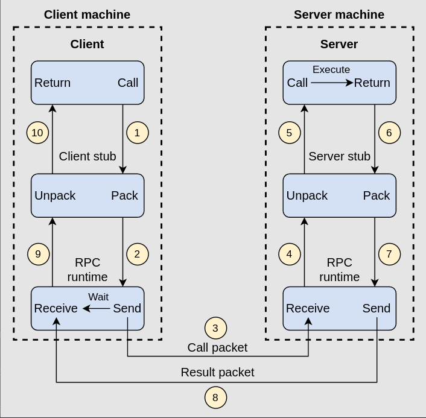

<h1>Network Abstractions: Remote Procedure Calls</h1>

Remote procedure calls (RPCs) provide an abstraction of a local procedure call to the developers 
by hiding the complexities of packing and sending function arguments to the remote server, 
receiving the return values, and managing any network retries.

<h2>What is an RPC?</h2>
RPC is an interprocess communication protocol that’s widely used in distributed systems. 
In the OSI model of network communication, RPC spans the transport and application layers.

RPC mechanisms are employed when a computer program causes a procedure or subroutine to execute in a separate address space.

<h2>How does RPC work?</h2>
When we make a remote procedure call, the calling environment is paused and the procedure parameters 
are sent over the network to the environment where the procedure is to be executed.

When the procedure execution finishes, the results are returned to the calling environment where execution restarts 
as a regular procedure call.

The client, the client stub, and one instance of RPC runtime are running on the client machine. 
The server, the server stub, and one instance of RPC runtime are running on the server machine.

During the RPC process, the following steps occur:
1. A client initiates a client stub process by giving parameters as normal. 
The client stub is stored in the address space of the client.
2. The client stub converts the parameters into a standardized format and packs them into a message. 
After packing the parameter into a message, the client stub requests the local RPC runtime to deliver the message to the server.
3. The RPC runtime at the client delivers the message to the server over the network. After sending a message to the server, 
it waits for the message result from the server.
4. RPC runtime at the server receives the message and passes it to the server stub.
Note: The RPC runtime is responsible for transmitting messages between client and server via the network. 
The responsibilities of RPC runtime also include retransmission, acknowledgment, and encryption.
5. The server stub unpacks the message, takes the parameters out of it, and calls the desired server routine, 
using a local procedure call, to do the required execution.
6. After the server routine has been executed with the given parameters, the result is returned to the server stub.
7. The server stub packs the returned result into a message and sends it to the RPC runtime 
at the server on the transport layer.
8. The server’s RPC runtime returns the packed result to the client’s RPC runtime over the network.
9. The client’s RPC runtime that was waiting for the result now receives the result and sends it to the client stub.
10. The client stub unpacks the result, and the execution process returns to the caller at this point.
Note: Back-end services use RPC as a communication mechanism of choice due to its high performance 
and simple abstraction of calling remote code as local functions.

<h2>Summary</h2>
The RPC method is similar to calling a local procedure, except that the called procedure is usually executed 
in a different process and on a different computer.

RPC allows developers to build applications on top of distributed systems. Developers can use the RPC method 
without knowing the network communication details. As a result, they can concentrate on the design aspects, 
rather than the machine and communication-level specifics.
