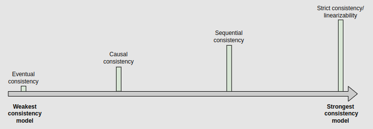

<h1>Spectrum of Consistency Models</h1>

<h2>What is consistency?</h2>
In distributed systems, consistency may mean many things. One is that each replica node has 
the same view of data at a given point in time. The other is that each read request gets the value of the recent write. 
These are not the only definitions of consistency, since there are many forms of consistency. Normally, 
consistency models provide us with abstractions to reason about the correctness of a distributed system 
doing concurrent data reads, writes, and mutations.

If we have to design or build an application in which we need a third-party storage system like S3 or Cassandra, 
we can look into the consistency guarantees provided by S3 to decide whether to use it or not. 
Let’s explore different types of consistency.

The two ends of the consistency spectrum are:
* Strongest consistency
* Weakest consistency

There are consistency models that lie between these two ends, some of which are shown in the following illustration:

There is a difference between consistency in ACID properties and consistency in the CAP theorem.

Database rules are at the heart of ACID consistency. If a schema specifies that a value must be unique, 
a consistent system will ensure that the value is unique throughout all actions. 
If a foreign key indicates that deleting one row will also delete associated rows, a consistent system ensures 
that the state can’t contain related rows once the base row has been destroyed.

CAP consistency guarantees that, in a distributed system, every replica of the same logical value 
has the same precise value at all times. It’s worth noting that this is a logical rather than a physical guarantee. 
Due to the speed of light, replicating numbers throughout a cluster may take some time. 
By preventing clients from accessing different values at separate nodes, 
the cluster can nevertheless give a logical picture.

<h2>Eventual consistency</h2>
Eventual consistency is the weakest consistency model. The applications that don’t have strict ordering requirements 
and don’t require reads to return the latest write choose this model. Eventual consistency ensures 
that all the replicas will eventually return the same value to the read request, 
but the returned value isn’t meant to be the latest value. However, the value will finally reach its latest state.

Eventual consistency ensures high availability.

Example:
The domain name system is a highly available system that enables name lookups to a hundred million devices across the Internet. 
It uses an eventual consistency model and doesn’t necessarily reflect the latest values.

Note: Cassandra is a highly available NoSQL database that provides eventual consistency.

<h2>Causal consistency</h2>
Causal consistency works by categorizing operations into dependent and independent operations. 
Dependent operations are also called causally-related operations. 
Causal consistency preserves the order of the causally-related operations.

This model doesn’t ensure ordering for the operations that are not causally related. 
These operations can be seen in different possible orders.

Causal consistency is weaker overall, but stronger than the eventual consistency model. 
It’s used to prevent non-intuitive behaviors.

Example:
The causal consistency model is used in a commenting system. For example, for the replies to a comment on a Facebook post, 
we want to display comments after the comment it replies to. 
This is because there is a cause-and-effect relationship between a comment and its replies.

<h2>Sequential consistency</h2>
Sequential consistency is stronger than the causal consistency model. It preserves the ordering specified by each client’s program. 
However, sequential consistency doesn’t ensure that the writes are visible instantaneously or in the same order 
as they occurred according to some global clock.

Example:
In social networking applications, we usually don’t care about the order in which some of our friends’ posts appear. 
However, we still anticipate a single friend’s posts to appear in the correct order in which they were created). 
Similarly, we expect our friends’ comments in a post to display in the order that they were submitted. 
The sequential consistency model captures all of these qualities.

<h2>Strict consistency aka linearizability</h2>
A strict consistency or linearizability is the strongest consistency model. 
This model ensures that a read request from any replicas will get the latest write value. 
Once the client receives the acknowledgment that the write operation has been performed, 
other clients can read that value.

Linearizability is challenging to achieve in a distributed system. Some of the reasons for such challenges 
are variable network delays and failures. The following slides show depicts how variable network delays make it possible 
for different parties to see different values.

Usually, synchronous replication is one of the ingredients for achieving strong consistency, 
though it in itself is not sufficient. We might need consensus algorithms such as Paxos 
and Raft to achieve strong consistency.

Linearizability affects the system’s availability, which is why it’s not always used. 
Applications with strong consistency requirements use techniques like quorum-based replication to increase the system’s availability.

Example:
Updating an account’s password requires strict consistency. For example, if we suspect suspicious activity on our bank account, 
we immediately change our password so that no unauthorized users can access our account. 
If it were possible to access our account using an old password due to a lack of strict consistency, 
then changing passwords would be a useless security strategy.

Note: Amazon Aurora provides strong consistency.

<h2>Summary</h2>
Linearizable services appear to carry out transactions/operations in sequential, real-time order. 
They make it easier to create suitable applications on top of them by limiting the number of values 
that services can return to application processes.

Linearizable services have worse performance rates than services with weaker consistency in exchange 
for their strong assurances. Think about a read in a key-value store that returns the value written by a concurrent write. 
The read imposes no limits on future reads if the key-value store is weakly consistent.

Application programmers have to compromise performance and availability if they use services with strong consistency models. 
The models may break the invariants of applications built on top of them in exchange for increased performance.
