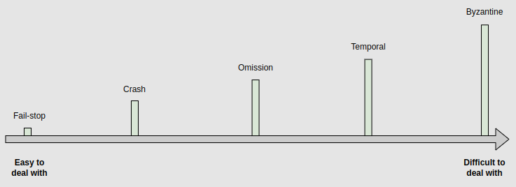

<h1>The Spectrum of Failure Models</h1>
Failures are obvious in the world of distributed systems and can appear in various ways. They might come and go, or persist for a long period.

Failure models provide us a framework to reason about the impact of failures and possible ways to deal with them.

Here is an illustration that presents a spectrum of different failure models:

<h2>Fail-stop</h2>
In this type of failure, a node in the distributed system halts permanently. However, 
the other nodes can still detect that node by communicating with it.

From the perspective of someone who builds distributed systems, 
fail-stop failures are the simplest and the most convenient.

<h2>Crash</h2>
In this type of failure, a node in the distributed system halts silently, and the other nodes can’t detect 
that the node has stopped working.

<h2>Omission failures</h2>
In omission failures, the node fails to send or receive messages. There are two types of omission failures. 
If the node fails to respond to the incoming request, it’s said to be a send omission failure. 
If the node fails to receive the request and thus can’t acknowledge it, it’s said to be a receive omission failure.

<h2>Temporal failures</h2>
In temporal failures, the node generates correct results, but is too late to be useful. 
This failure could be due to bad algorithms, a bad design strategy, or a loss of synchronization between the processor clocks.

<h2>Byzantine failures</h2>
In Byzantine failures, the node exhibits random behavior like transmitting arbitrary messages at arbitrary times, 
producing wrong results, or stopping midway. This mostly happens due to an attack by a malicious entity or a software bug. 
A byzantine failure is the most challenging type of failure to deal with.
