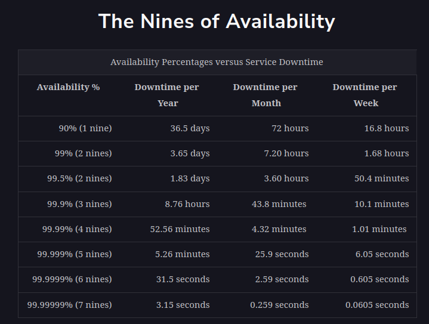

<h1>Availability</h1>

<h2>What is availability?</h2>
Availability is the percentage of time that some service or infrastructure is accessible to clients 
and is operated upon under normal conditions. For example, if a service has 100% availability, 
it means that the said service functions and responds as intended (operates normally) all the time.

<h3>Measuring availability</h3>
Mathematically, availability, A, is a ratio. The higher the A value, the better. We can also write this up as a formula:
A% = (Total Time - Amount Of Time Service Was Down) / Total Time * 100

We measure availability as a number of nines. The following table shows how much downtime is permitted 
when we’re using a given number of nines.

<h3>Availability and service providers</h3>
Each service provider may start measuring availability at different points in time. 
Some cloud providers start measuring it when they first offer the service, while some measure it for specific clients 
when they start using the service. Some providers might not reduce their reported availability numbers 
if their service was not down for all the clients. The planned downtimes are excluded. 
Downtime due to cyberattacks might not be incorporated into the calculation of availability. 
Therefore, we should carefully understand how a specific provider calculates their availability numbers.
