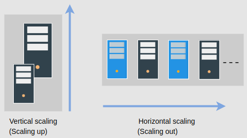

<h1>Scalability</h1>

<h2>What is scalability?</h2>
Scalability is the ability of a system to handle an increasing amount of workload without compromising performance. 
A search engine, for example, must accommodate increasing numbers of users, as well as the amount of data it indexes.

The workload can be of different types, including the following:
* Request workload: This is the number of requests served by the system.
* Data/storage workload: This is the amount of data stored by the system.

<h2>Dimensions</h2>
Here are the different dimensions of scalability:
* Size scalability: A system is scalable in size if we can simply add additional users and resources to it.
* Administrative scalability: This is the capacity for a growing number of organizations or users to share a single distributed system with ease.
* Geographical scalability: This relates to how easily the program can cater to other regions while maintaining acceptable performance constraints. 
In other words, the system can readily service a broad geographical region, as well as a smaller one.

<h2>Different approaches of scalability</h2>
Here are the different ways to implement scalability.

<h3>Vertical scalability—scaling up</h3>
Vertical scaling, also known as “scaling up,” refers to scaling by providing additional capabilities 
(for example, additional CPUs or RAM) to an existing device. Vertical scaling allows us to expand our present hardware 
or software capacity, but we can only grow it to the limitations of our server. 
The dollar cost of vertical scaling is usually high because we might need exotic components to scale up.

<h3>Horizontal scalability—scaling out</h3>
Horizontal scaling, also known as “scaling out,” refers to increasing the number of machines in the network. 
We use commodity nodes for this purpose because of their attractive dollar-cost benefits. 
The catch here is that we need to build a system such that many nodes could collectively work as if we had a single, 
huge server.

