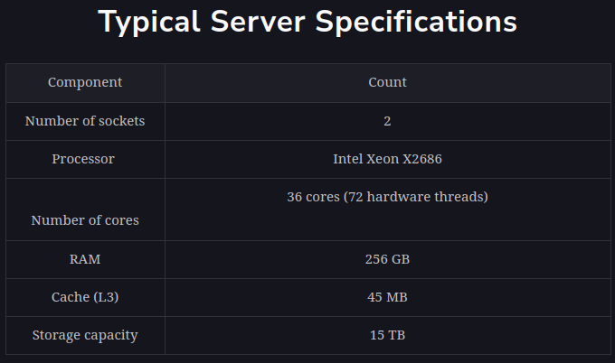
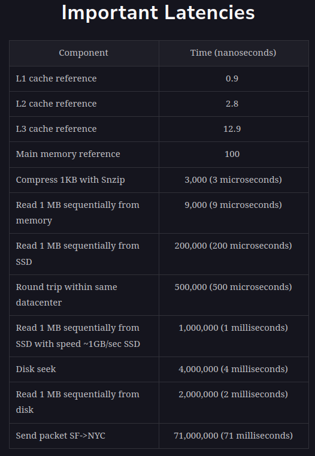
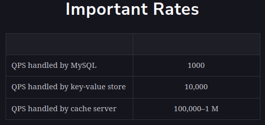

<h1>Put Back-of-the-envelope Numbers in Perspective</h1>

<h2>Why do we use back-of-the-envelope calculations?</h2>
A distributed system has compute nodes connected via a network. There’s a wide variety of available compute nodes 
and they can be connected in many different ways. Back-of-the-envelope calculations help us ignore the nitty-gritty details 
of the system (at least at the design level) and focus on more important aspects.

Some examples of a back-of-the-envelope calculation could be:
* The number of concurrent TCP connections a server can support.
* The number of requests per second (RPS) a web, database, or cache server can handle.
* The storage requirements of a service.

Choosing an unreasonable number for such calculations can lead to a flawed design. 
Since we need good estimations in many design problems, we’ll discuss all the relevant concepts in detail in this lesson. 
These concepts include:
* The types of data center servers.
* The realistic access latencies of different components.
* The estimation of RPS that a server can handle.
* Examples of bandwidth, servers, and storage estimation.

<h2>Types of data center servers</h2>
Data centers don’t have a single type of server. Enterprise solutions use commodity hardware 
to save cost and develop scalable solutions. Below, we discuss the types of servers 
that are commonly used within a data center to handle different workloads.

<h3>Web servers</h3>
For scalability, the web servers are decoupled from the application servers. 
Web servers are the first point of contact after load balancers. Data centers have racks full of web servers 
that usually handle API calls from the clients. Depending on the service that’s offered, 
the memory and storage resources in web servers can be small to medium. However, such servers require good computational resources. 
For example, Facebook has used a web server with 32 GB of RAM and 500 GB of storage space. 
But for its high-end computational needs, it partnered with Intel to build a custom 16-core processor.

<h3>Application servers</h3>
Application servers run the core application software and business logic. The difference between web servers 
and application servers is somewhat fuzzy. Application servers primarily provide dynamic content, 
whereas web servers mostly serve static content to the client, which is mostly a web browser. 
They can require extensive computational and storage resources. Storage resources can be volatile and non-volatile. 
Facebook has used application servers with a RAM of up to 256 GB and two types of storage—traditional rotating disks 
and flash—with a capacity of up to 6.5 TB.

<h3>Storage servers</h3>
With the explosive growth of Internet users, the amount of data stored by giant services has multiplied. 
Additionally, various types of data are now being stored in different storage units. 
For instance, YouTube uses the following datastores:
1. Blob storage for its encoded videos.
2. A temporary processing queue storage that can hold a few hundred hours of video content uploaded daily to YouTube for processing.
3. Specialized storage called Bigtable for storing a large number of thumbnails of videos.
4. Relational database management system (RDBMS) for users and videos metadata (comments, likes, user channels, and so on.

Other data stores are still used for analytics—for example, Hadoop’s HDFS. 
Storage servers mainly include structured (for example, SQL) and non-structured (NoSQL) data management systems.

Coming back to the example of Facebook, we know that they’ve used servers with a storage capacity of up to 120 TB. 
With the number of servers in use, Facebook is able to house exabytes of storage. One exabyte is 10^18 Bytes. 
By convention, we measure storage and network bandwidth in base 10, and not base 2. 
However, the RAM of these servers is only 32 GB.

Note: The servers described above are not the only types of servers in a data center. 
Organizations also require servers for services like configuration, 
monitoring, load balancing, analytics, accounting, caching, and so on.

The numbers open-sourced by Facebook are outdated as of now. In the table below, 
we depict the capabilities of a server that can be used in the data centers of today:

Typical Server Specifications

The numbers above are inspired by the Amazon bare-metal server, but there can be more 
or less powerful machines supporting much higher RAM (up to 8 TB), disk storage 
(up to 24 disks with up to 20 TB each, circa 2021), and cache memory (up to 120 MB).

<h2>Standard numbers to remember</h2>
A lot of effort goes into the planning and implementation of a service. 
But without any basic knowledge of the kind of workloads machines can handle, this planning isn’t possible. 
Latencies play an important role in deciding the amount of workload a machine can handle. 
The table below depicts some of the important numbers system designers should know in order to perform resource estimation.

Important Latencies

Apart from the latencies listed above, there are also throughput numbers measured as queries per second (QPS) 
that a typical single-server datastore can handle.

Important Rates

The numbers above are approximations and vary greatly depending on a number of reasons like the type of query (point and range), 
the specification of the machine, the design of the database, the indexing, and so on.
^ point - A lookup for a single item is called as Point query. 
For example, SELECT * FROM STUDENTS WHERE NAME = "John"; This is a point query because search is for a single value “John”.

^ range - A query that retrieves information/records in between boundaries. 
For example, SELECT * FROM STUDENTS WHERE age BETWEEN 15 AND 18;.

<h2>Requests estimation</h2>
This section discusses the number of requests a typical server can handle in a second. Within a server, 
there are limited resources and depending on the type of client requests, different resources can become a bottleneck. 
Let’s understand two types of requests.

* CPU-bound requests: These are the type of requests where the limiting factor is the CPU.
* Memory-bound requests: These are the types of requests that are limited by the amount of memory a machine has.

Let’s approximate the RPS for each type of request. But before that, we need to assume the following:
* Our server has the specifications of the typical server that we defined in the table above.
* Operating systems and other auxiliary processes have consumed a total of 16 GB of RAM.
* Each worker consumes 300 MBs of RAM storage to complete a request.
* For simplicity, we assume that the CPU obtains data from the RAM. 
Therefore, a caching system ensures that all the required content is available for serving, without there being a need to access the storage layer.
* Each CPU-bound request takes 200 milliseconds, whereas a memory-bound request takes 50 milliseconds to complete.

Let’s do the computation for each type of request.

CPU bound: A simple formula used to calculate the RPS for CPU-bound requests is:
RPS cpu = Num cpu * 1/Task time
In this calculation, we use these terms:
RPS cpu: CPU bound RPS
Num cpu: Number of CPU threads, which are also called hardware threads
Task time: The time each task takes to complete
Then, RPS cpu = 72 * (1/200ms) = 360 RPS

The rationale for the calculation shown above is that we can visualize one second as a box 
and we calculate how many mini-boxes (tasks) can fit inside the big box—that is, 
the number of tasks that can be completed in one second by a number of CPUs. 
So, a higher number of CPUs/threads will result in a higher RPS.

Memory-bound requests: For memory-bound requests, we use the following formula:
RPS memory = (RAM size / Worker memory) * (1 / Task time)
In this calculation, we use these terms:
RPS memory: Memory bound RPS
RAM size: Total size of RAM
Worker memory: A worker in memory that manages a request
Then, RPS memory = (240 Gb / 300 mb) * (1 / 50 ms) = 16.000 RPS

Continuing our box analogy from the explanation of CPU-bound processes, 
here we first calculate the number of boxes there are (how many memory-bound processes a server can host) 
and then how many mini-boxes (tasks) we can fit in each of the bigger boxes.

A service receives both the CPU-bound and memory-bound requests. 
Considering the case that half the requests are CPU-bound and the other half memory-bound, we can handle a total of
(360/2) + (16.000 / 2) = 8.180 ~ 8.000 RPS

The calculations above are only an approximation for developing an understanding of the basic factors involved in estimating RPS. 
In reality, a lot of other factors come into play. For instance, 
latency is required to do a disk seek in case the data is not readily available in RAM or if a request is made to the database server, 
which will also include the database and network latency. Additionally, the type of query also matters. 
Of course, faults, bugs in code, node failures, power outages, network disruptions, and more are inevitable factors.

On a typical day, various types of requests arrive, and a powerful server that only serves static content f
rom the RAM might handle as many as 500k RPS. On the other end of the spectrum, computational-intensive tasks 
like image processing may only allow a maximum of 50 RPS.

Note: In reality, capacity estimation is a hard problem, and organizations learn how to improve it over the years. 
A monitoring system keeps an eye on all parts of our infrastructure to give us early warnings about overloading servers.
