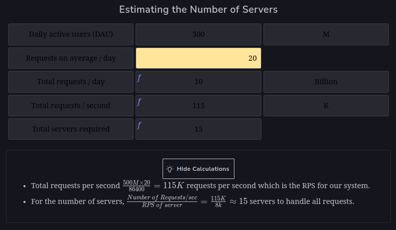
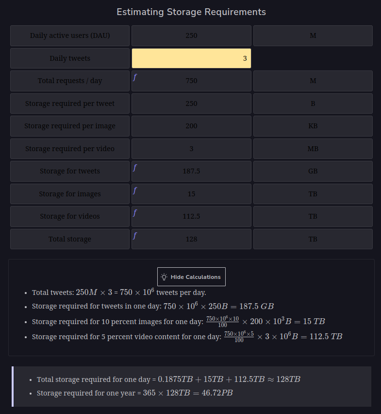
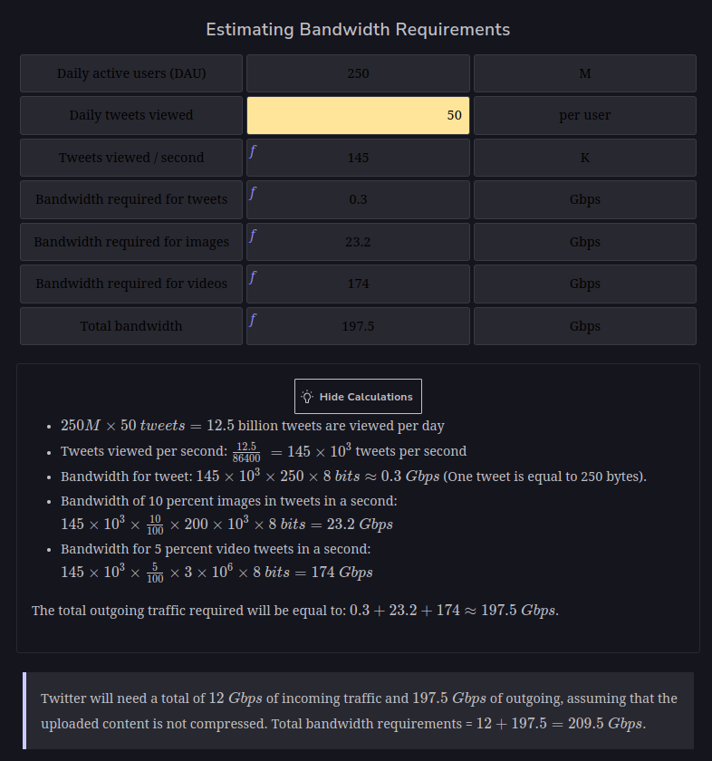

<h1>Examples of Resource Estimation</h1>

<h2>Introduction</h2>
Now that we’ve set the foundation for resource estimation, let’s make use of our background knowledge 
to estimate resources like servers, storage, and bandwidth. Below, we consider a scenario and a service, 
make assumptions, and based on those assumptions, we make estimations. Let’s jump right in!

<h2>Number of servers required</h2>
Let’s make the following assumptions about a Twitter-like service.

Assumptions:
* There are 500 million (M) daily active users (DAU).
* A single user makes 20 requests per day on average.
* Recall that a single server can handle 8,000 RPS.

Indeed, the number above doesn’t seem right. If we only need 15 commodity servers to serve 500M daily users, 
then why do big services use millions of servers in a data center? The primary reason for this is 
that the RPS is not enough to estimate the number of servers required to provide a service. 
Also, we made some underlying assumptions in the calculations above. One of the assumptions was 
that a request is handled by one server only. In reality, requests go through to web servers that may interact 
with application servers that may also request data from storage servers. 
Each server may take a different amount of time to handle each request. Furthermore, 
each request may be handled differently depending upon the state of the data center, the application, and the request itself. 
Remember that we have a variety of servers for providing various services within a data center.

We have established that:
1. Finding accurate capacity estimations is challenging due to many factors—for example, each service being designed differently, 
having different fan-out rules and hardware, server responsibilities changing over time, etc.
2. At the design level, a coarse-grained estimation is appropriate because the purpose is to come up 
with reasonable upper bounds on the required resources. We can also use advanced methods from the queuing theory 
and operations research to make better estimates. However, an interview or initial design is not an appropriate time to use such a strategy. 
Real systems use various methods (back-of-the-envelope calculations, simulations, prototyping, 
and monitoring) to improve on their initial (potentially sloppy) estimates gradually.

Therefore, we approximate the number of servers by depicting how many clients a server handles on a given day:
Number of daily active users / RPS of a server

To have a better approximation, let's use the following two assumptions:
1. We assume that each daily active user (DAU) of the service sends just one request per day.
Number of daily active users / RPS of a server = Number of requests day / RPS of server
2. We assume that there is a specific second in the day when all the requests of all the users arrive at the service simultaneously. 
We use it to get the capacity estimation for a peak load. To do better, we will need request and response distributions, 
which might be available at the prototyping level. We might assume that distributions follow a particular type of distribution, 
for example, the Poisson distribution. By using DAU as a proxy for peak load for a specific second, 
we have avoided difficulties finding the arrival rates of requests and responses.

Therefore, the DAU will then become the number of requests per second. We already have RPS for a server; therefore, equation (1) becomes:
Number of requests second / RPS of server

By inserting values in the equation above, we yield the following number of servers:
Number of requests second / RPS of server = 500 M / 8000 = 62.500

Note: Our calculations are based on an approximation that might not give us a tight bound on the number of servers, 
but still it’s a realistic one. Therefore, we use this approach in estimating the number of servers in our design problems. 
Informally, the equation given above assumes that one server can handle 8,000 users per second. 
We use this reference in the rest of the course as well.

<h2>Storage requirements</h2>
In this section, we attempt to understand how storage estimation is done by using Twitter as an example. 
We estimate the amount of storage space required by Twitter for new tweets in a year. 
Let’s make the following assumptions to begin with:
* We have a total of 250 M daily active users.
* Each user posts three tweets in a day.
* Ten percent of the tweets contain images, whereas five percent of the tweets contain a video. 
Any tweet containing a video will not contain an image and vice versa.
* Assume that an image is 200 KB and a video is 3 MB in size on average.
* The tweet text and its metadata require a total of 250 Bytes of storage in the database.

Then, the following storage space will be required:

* Total storage required for one day = 0.1875 TB + 15 TB + 112.5 TB ~ 128 TB
* Storage required for one year = 365 * 128 TB = 46.72 PB

<h2>Bandwidth requirements</h2>
In order to estimate the bandwidth requirements for a service, we use the following steps:
1. Estimate the daily amount of incoming data to the service.
2. Estimate the daily amount of outgoing data from the service.
3. Estimate the bandwidth in Gbps (gigabits per second) 
by dividing the incoming and outgoing data by the number of seconds in a day.

Incoming traffic: Let’s continue from our previous example of Twitter, which requires 128 TBs of storage each day. 
Therefore, the incoming traffic should support the following bandwidth per second:
(128 x 10^12) / 86400 * 8 ~ 12 Gbps

Note: We multiply by 8 in order to convert Bytes(B) into bits(b) because bandwidth is measured in bits per second.

Outgoing traffic: Assume that a single user views 50 tweets in a day. Considering the same ratio of five percent 
and 10 percent for videos and images, respectively, for the 50 tweets, 2.5 tweets will contain video content 
whereas five tweets will contain an image. Considering that there are 250 M active daily users, we come to the following estimations:

