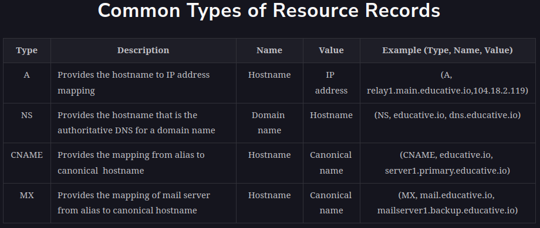

<h1>Introduction to Domain Name System (DNS)</h1>

<h2>The origins of DNS</h2>
Let’s consider the example of a mobile phone where a unique number is associated with each user. 
To make calls to friends, we can initially try to memorize some of the phone numbers. However, 
as the number of contacts grows, we’ll have to use a phone book to keep track of all our contacts. 
This way, whenever we need to make a call, we’ll refer to the phone book and dial the number we need.

Similarly, computers are uniquely identified by IP addresses—for example, 104.18.2.119 is an IP address. 
We use IP addresses to visit a website hosted on a machine. Since humans cannot easily remember IP addresses 
to visit domain names (an example domain name being educative.io), we need a phone book-like repository 
that can maintain all mappings of domain names to IP addresses. In this chapter, 
we’ll see how DNS serves as the Internet’s phone book.

<h2>What is DNS?</h2>
The domain name system (DNS) is the Internet’s naming service that maps human-friendly domain names to machine-readable IP addresses. 
The service of DNS is transparent to users. When a user enters a domain name in the browser, 
the browser has to translate the domain name to IP address by asking the DNS infrastructure. 
Once the desired IP address is obtained, the user’s request is forwarded to the destination web server.

The steps below show the high-level flow of the working of DNS:
1. The user requests to visit a website by entering its URL in the browser
2. The browser requests the ISP to forward the DNS query to resolve the request for the IP address
3. The ISP forwards the DNS query to the DNS infrastructure
4. The DNS infrastructure responds with a list of IP addresses against the domain name
5. The IP address(es) reach the browser
6. The browser sends an HTTP request on the received IP address
7. The ISP forwards the HTTP request to the web server

The entire operation is performed very quickly. Therefore, the end user experiences minimum delay. 
We’ll also see how browsers save some of the frequently used mappings for later use in the next lesson.

<h2>Important details</h2>
* Name servers: It’s important to understand that the DNS isn’t a single server. 
It’s a complete infrastructure with numerous servers. DNS servers that respond to users’ queries are called name servers.
* Resource records: The DNS database stores domain name to IP address mappings in the form of resource records (RR). 
The RR is the smallest unit of information that users request from the name servers. There are different types of RRs. 
The table below describes common RRs. The three important pieces of information are type, name, and value. 
The name and value change depending upon the type of the RR.

* Caching: DNS uses caching at different layers to reduce request latency for the user. 
Caching plays an important role in reducing the burden on DNS infrastructure because it has to cater to the queries of the entire Internet.
* Hierarchy: DNS name servers are in a hierarchical form. The hierarchical structure allows DNS to be highly scalable 
because of its increasing size and query load. In the next lesson, we’ll look at how a tree-like structure is used to manage the entire DNS database.

Let's explore more details of the above points in the next lesson to get more clarity.
