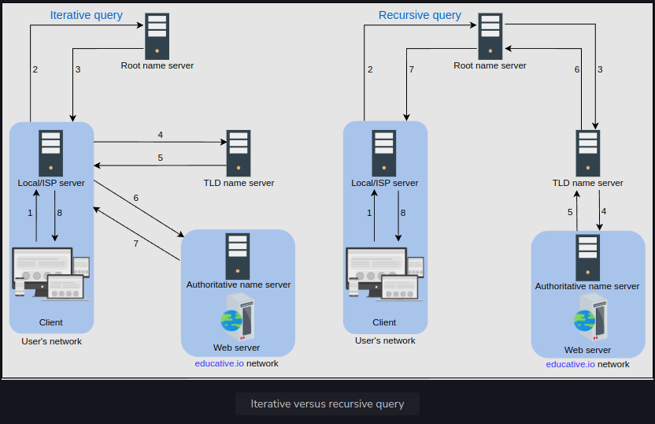

<h1>How the Domain Name System Works</h1>

Through this lesson, we’ll answer the following questions:
* How is the DNS hierarchy formed using various types of DNS name servers?
* How is caching performed at different levels of the Internet to reduce the querying burden over the DNS infrastructure?
* How does the distributed nature of the DNS infrastructure help its robustness?

<h2>DNS hierarchy</h2>
As stated before, the DNS isn’t a single server that accepts requests and responds to user queries. 
It’s a complete infrastructure with name servers at different hierarchies.

There are mainly four types of servers in the DNS hierarchy:
1. DNS resolver: Resolvers initiate the querying sequence and forward requests to the other DNS name servers. 
Typically, DNS resolvers lie within the premise of the user’s network. However, 
DNS resolvers can also cater to users’ DNS queries through caching techniques, as we will see shortly. 
These servers can also be called local or default servers.
2. Root-level name servers: These servers receive requests from local servers. Root name servers maintain name servers 
based on top-level domain names, such as .com, .edu, .us, and so on. For instance, 
when a user requests the IP address of educative.io, root-level name servers 
will return a list of top-level domain (TLD) servers that hold the IP addresses of the .io domain.
3. Top-level domain (TLD) name servers: These servers hold the IP addresses of authoritative name servers. 
The querying party will get a list of IP addresses that belong to the authoritative servers of the organization.
4. Authoritative name servers: These are the organization’s DNS name servers that provide the IP addresses of the web 
or application servers.

<h3>Iterative versus recursive query resolution</h3>
There are two ways to perform a DNS query:
1. Iterative: The local server requests the root, TLD, and the authoritative servers for the IP address.
2. Recursive: The end user requests the local server. The local server further requests the root DNS name servers. \
The root name servers forward the requests to other name servers.

<h2>Caching</h2>
Caching refers to the temporary storage of frequently requested resource records. 
A record is a data unit within the DNS database that shows a name-to-value binding. 
Caching reduces response time to the user and decreases network traffic. 
When we use caching at different hierarchies, it can reduce a lot of querying burden on the DNS infrastructure. 
Caching can be implemented in the browser, operating systems, local name server within the user’s network, 
or the ISP’s DNS resolvers.

List of actions below demonstrates the power of caching in the DNS:
1. The user requests to visit a URL, and the browser has cached the domain name to IP address mapping
2. Here’s what happens if the browser hasn't cached the domain to IP address mapping. 
The next hierarchy that can have the mapping is the OS
3. If the OS doesn't have the mapping, the local DNS resolver can have the cached response
4. If the local DNS resolver doesn't have the mapping, the ISP can have a cached response
5. Finally, the DNS infrastructure will respond with the IP
6. The cache will be updated at each hierarchy
7. The browser now has updated cache so the user request will get served locally

Note: Even if there is no cache available to resolve a user’s query and it’s imperative to visit the DNS infrastructure, 
caching can still be beneficial. The local server or ISP DNS resolver can cache the IP addresses of TLD servers 
or authoritative servers and avoid requesting the root-level server.

<h2>DNS as a distributed system</h2>
Although the DNS hierarchy facilitates the distributed Internet that we know today, it’s a distributed system itself. 
The distributed nature of DNS has the following advantages:
* It avoids becoming a single point of failure (SPOF).
* It achieves low query latency so users can get responses from nearby servers.
* It gets a higher degree of flexibility during maintenance and updates or upgrades. 
For example, if one DNS server is down or overburdened, another DNS server can respond to user queries.

There are 13 logical root name servers (named letter A through M) with many instances spread throughout the globe. 
These servers are managed by 12 different organizations.

Let’s now go over how DNS is scalable, reliable, and consistent.

<h3>Highly scalable</h3>
Due to its hierarchical nature, DNS is a highly scalable system. Roughly 1,000 replicated instances 
of 13 root-level servers are spread throughout the world strategically to handle user queries. 
The working labor is divided among TLD and root servers to handle a query and, finally, 
the authoritative servers that are managed by the organizations themselves to make the entire system work. 
As shown in the DNS hierarchy tree above, different services handle different portions of the tree enabling scalability 
and manageability of the system.

<h3>Reliable</h3>
Three main reasons make the DNS a reliable system:
1. Caching: The caching is done in the browser, the operating system, and the local name server, 
and the ISP DNS resolvers also maintain a rich cache of frequently visited services. 
Even if some DNS servers are temporarily down, cached records can be served to make DNS a reliable system.
2. Server replication: DNS has replicated copies of each logical server spread systematically across the globe 
to entertain user requests at low latency. The redundant servers improve the reliability of the overall system.
3. Protocol: Although many clients rely on the unreliable User Datagram Protocol (UDP) to request and receive DNS responses, 
it is important to acknowledge that UDP also offers distinct advantages. UDP is much faster and, therefore, 
improves DNS performance. Furthermore, Internet service’s reliability has improved since its inception, 
so UDP is usually favored over TCP. A DNS resolver can resend the UDP request if it didn’t get a reply to a previous one. 
This request-response needs just one round trip, which provides a shorter delay as compared to TCP, 
which needs a three-way handshake before data exchange.

<h3>Consistent</h3>
DNS uses various protocols to update and transfer information among replicated servers in a hierarchy. 
DNS compromises on strong consistency to achieve high performance because data is read frequently from DNS databases as compared to writing. 
However, DNS provides eventual consistency and updates records on replicated servers lazily. 
Typically, it can take from a few seconds up to three days to update records on the DNS servers across the Internet. 
The time it takes to propagate information among different DNS clusters depends on the DNS infrastructure, 
the size of the update, and which part of the DNS tree is being updated.
Consistency can suffer because of caching too. Since authoritative servers are located within the organization, 
it may be possible that certain resource records are updated on the authoritative servers in case of server failures at the organization. 
Therefore, cached records at the default/local and ISP servers may be outdated. To mitigate this issue, 
each cached record comes with an expiration time called time-to-live (TTL).
