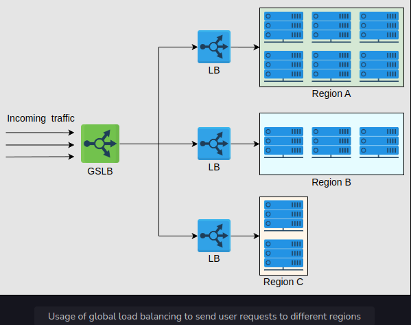

<h1>Global and Local Load Balancing</h1>

<h2>Introduction</h2>
From the previous lesson, it may seem like load balancing is performed only within the data center. 
However, load balancing is required at a global and a local scale. Let’s understand the function of each of the two:
* Global server load balancing (GSLB): GSLB involves the distribution of traffic load across multiple geographical regions.
* Local load balancing: This refers to load balancing achieved within a data center. This type of load balancing focuses 
on improving efficiency and better resource utilization of the hosting servers in a data center.

Let’s understand each of the two techniques below.

<h2>Global server load balancing</h2>
GSLB ensures that globally arriving traffic load is intelligently forwarded to a data center. 
For example, power or network failure in a data center requires that all the traffic be rerouted to another data center. 
GSLB takes forwarding decisions based on the users’ geographic locations, the number of hosting servers in different locations, 
the health of data centers, and so on.

The illustration below shows that the GSLB can forward requests to three different data centers. 
Each local load balancing layer within a data center will maintain a control plane connection 
with the GSLB providing information about the health of the LBs and the server farm. 
GSLB uses this information to drive traffic decisions and forward traffic load based on each region’s configuration 
and monitoring information.

Now, we’ll discuss how the domain name system (DNS) can perform GSLB.

<h3>Load balancing in DNS</h3>
We understand that DNS can respond with multiple IP addresses for a DNS query. In the lesson on DNS, 
we discussed that it’s possible to do load balancing through DNS while looking at the output of nslookup. 
DNS uses a simple technique of reordering the list of IP addresses in response to each DNS query. Therefore, 
different users get a reordered IP address list. It results in users visiting a different server to entertain their requests. 
In this way, DNS distributes the load of requests on different data centers. This is performing GSLB. In particular, 
DNS uses round-robin to perform load balancing as shown below:
1. The user from ISP 1 requests the DNS infrastructure for the IP address of a service
2. DNS responds with the IP address of data center 1
3. The user sends a request to data center 1
4. The user from ISP 1 gets served at data center 1
5. The user from ISP 2 requests the DNS infrastructure for the IP address of the same service
6. DNS responds with the IP address of data center 2 and does GSLB
7. The user sends a request to data center 2
8. The user from ISP 2 gets served at data center 2
9. The user from ISP 3 requests the DNS infrastructure for the IP address of the same service
10. DNS responds with the IP address of data center 3 and does GSLB
11. The user sends a request to data center 3
12. The user from ISP 3 gets served at data center 3
13. The user from ISP 4 requests the DNS infrastructure for the IP address of the same service
14. DNS responds with the IP address of data center 1 and does GSLB in round-robin fashion
15. The user sends a request to data center 1
16. The user from ISP 4 gets served at data center 1

As shown above, round-robin in DNS forwards clients to data centers in a strict circular order. 
However, round-robin has the following limitations:
* Different ISPs have a different number of users. An ISP serving many customers will provide the same cached IP to its clients, 
resulting in uneven load distribution on end-servers.
* Because the round-robin load-balancing algorithm doesn’t consider any end-server crashes, 
it keeps on distributing the IP address of the crashed servers until the TTL of the cached entries expires. 
Availability of the service, in that case, can take a hit due to DNS-level load balancing.

Despite its limitations, round-robin is still widely used by many DNS service providers. Furthermore, 
DNS uses short TTL for cached entries to do effective load balancing among different data centers.

Note: DNS isn’t the only form of GSLB. Application delivery controllers (ADCs) 
and cloud-based load balancing (discussed later) are better ways to do GSLB.

What are application delivery controllers (ADCs)?
Application delivery controllers (ADCs) are part of the application delivery network (ADN). 
They can be considered the superset of LBs offering various services, including load balancing. 
The primary task of ADCs is to perform web acceleration to reduce the load from the server farm. 
Some well-known services between layers 3 and 7 include caching, SSL offloading, proxy/reverse proxy services, 
IP traffic optimization, and many more. ADCs also implement GSLB.

<h3>The need for local load balancers</h3>
DNS plays a vital role in balancing the load, but it suffers from the following limitations:
* The small size of the DNS packet (512 Bytes) isn’t enough to include all possible IP addresses of the servers.
* There’s limited control over the client’s behavior. Clients may select arbitrarily from the received set of IP addresses. 
Some of the received IP addresses may belong to busy data centers.
* Clients can’t determine the closest address to establish a connection with. Although DNS geolocation 
and anycasting-like solutions can be implemented, they aren’t trivial solutions.
* In case of failures, recovery can be slow through DNS because of the caching mechanism, especially when TTL values are longer.

To solve some of the above problems, we need another layer of load balancing in the form of local LB. In the next lesson, 
we’ll discuss different details about local load balancers.

<h2>What is local load balancing?</h2>
Local load balancers reside within a data center. They behave like a reverse proxy and make their best effort 
to divide incoming requests among the pool of available servers. Incoming clients’ requests seamlessly connect 
to the LB that uses a virtual IP address (VIP).
