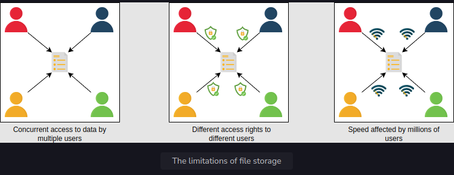
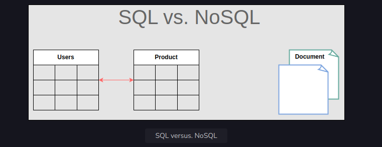

<h1>Introduction to Databases</h1>

<h2>Problem statement</h2>
Let’s start with a simple question. Can we make a software application without using databases? Let’s suppose we have an application like WhatsApp. People use our application to communicate with their friends. Now, where and how we can store information (a list of people’s names and their respective messages) permanently and retrieve it?

We can use a simple file to store all the records on separate lines and retrieve them from the same file. But using a file for storage has some limitations.

<h3>Limitations of file storage</h3>
* We can’t offer concurrent management to separate users accessing the storage files from different locations.
* We can’t grant different access rights to different users.
* How will the system scale and be available when adding thousands of entries?
* How will we search content for different users in a short time?

<h3>Solution</h3>
The above limitations can be addressed using databases.

A database is an organized collection of data that can be managed and accessed easily. Databases are created to make it easier to store, retrieve, modify, and delete data in connection with different data-processing procedures.

Some of the applications where we use database management are the banking systems, online shopping stores, and so on. Different organizations have different sizes of databases according to their needs.

Note: According to a source, the World Data Center for Climate (WDCC) is the largest database in the world. It contains around 220 terabytes of web data and 6 petabytes of additional data.

There are two basic types of databases:
* SQL (relational databases)
* NoSQL (non-relational databases)

They differ in terms of their intended use case, the type of information they hold, and the storage method they employ.

Relational databases, like phone books that record contact numbers and addresses, are organized and have predetermined schemas. Non-relational databases, like file directories that store anything from a person’s constant information to shopping preferences, are unstructured, scattered, and feature a dynamic schema. We’ll discuss their differences and their types in detail in the next lesson.

<h2>Advantages</h2>
A proper database is essential for every business or organization. This is because the database stores all essential information about the organization, such as personnel records, transactions, salary information, and so on. Following are some of the reasons why the database is important:
* Managing large data: A large amount of data can be easily handled with a database, which wouldn’t be possible using other tools.
* Retrieving accurate data (data consistency): Due to different constraints in databases, we can retrieve accurate data whenever we want.
* Easy updation: It is quite easy to update data in databases using data manipulation language (DML).
* Security: Databases ensure the security of the data. A database only allows authorized users to access data.
* Data integrity: Databases ensure data integrity by using different constraints for data.
* Availability: Databases can be replicated (using data replication) on different servers, which can be concurrently updated. These replicas ensure availability.
* Scalability: Databases are divided (using data partitioning) to manage the load on a single node. This increases scalability.
