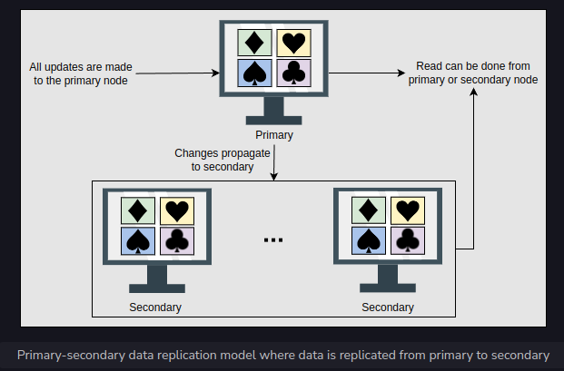

<h1>Data Replication</h1>

Data is an asset for an organization because it drives the whole business. 
Data provides critical business insights into what’s important and what needs to be changed. 
Organizations also need to securely save and serve their clients’ data on demand. 
Timely access to the required data under varying conditions (increasing reads and writes, 
disks and node failures, network and power outages, and so on) is required to successfully run an online business.

We need the following characteristics from our data store:
* Availability under faults (failure of some disk, nodes, and network and power outages).
* Scalability (with increasing reads, writes, and other operations).
* Performance (low latency and high throughput for the clients).

It’s challenging, or even impossible, to achieve the above characteristics on a single node.

<h2>Replication</h2>
Replication refers to keeping multiple copies of the data at various nodes (preferably geographically distributed) 
to achieve availability, scalability, and performance. In this lesson, 
we assume that a single node is enough to hold our entire data. 
We won’t use this assumption while discussing the partitioning of data in multiple nodes. Often, 
the concepts of replication and partitioning go together.

However, with many benefits, like availability, replication comes with its complexities. 
Replication is relatively simple if the replicated data doesn’t require frequent changes. 
The main problem in replication arises when we have to maintain changes in the replicated data over time.

Additional complexities that could arise due to replication are as follows:
* How do we keep multiple copies of data consistent with each other?
* How do we deal with failed replica nodes?
* Should we replicate synchronously or asynchronously?
* How do we deal with replication lag in case of asynchronous replication?
* How do we handle concurrent writes?
* What consistency model needs to be exposed to the end programmers?

Before we explain the different types of replication, let’s understand the synchronous and asynchronous approaches of replication.

<h2>Synchronous versus asynchronous replication</h2>
There are two ways to disseminate changes to the replica nodes:
* Synchronous replication
* Asynchronous replication

In synchronous replication, the primary node waits for acknowledgments from secondary nodes about updating the data. 
After receiving acknowledgment from all secondary nodes, the primary node reports success to the client. 
Whereas in asynchronous replication, the primary node doesn’t wait for the acknowledgment from the secondary nodes and reports success 
to the client after updating itself.

The advantage of synchronous replication is that all the secondary nodes are completely up to date with the primary node. 
However, there’s a disadvantage to this approach. If one of the secondary nodes doesn’t acknowledge due to failure or fault in the network, 
the primary node would be unable to acknowledge the client until it receives the successful acknowledgment from the crashed node. 
This causes high latency in the response from the primary node to the client.

On the other hand, the advantage of asynchronous replication is that the primary node can continue its work 
even if all the secondary nodes are down. However, if the primary node fails, 
the writes that weren’t copied to the secondary nodes will be lost.

The above paragraph explains a trade-off between data consistency 
and availability when different components of the system can fail.

<h2>Data replication models</h2>
Now, let’s discuss various mechanisms of data replication. In this section, 
we’ll discuss the following models along with their strengths and weaknesses:
* Single leader or primary-secondary replication
* Multi-leader replication
* Peer-to-peer or leaderless replication

<h3>Single leader/primary-secondary replication</h3>
In primary-secondary replication, data is replicated across multiple nodes. One node is designated as the primary. 
It’s responsible for processing any writes to data stored on the cluster. 
It also sends all the writes to the secondary nodes and keeps them in sync.

Primary-secondary replication is appropriate when our workload is read-heavy. 
To better scale with increasing readers, we can add more followers and distribute the read load across the available followers. 
However, replicating data to many followers can make a primary bottleneck. Additionally, 
primary-secondary replication is inappropriate if our workload is write-heavy.

Another advantage of primary-secondary replication is that it’s read resilient. 
Secondary nodes can still handle read requests in case of primary node failure. 
Therefore, it’s a helpful approach for read-intensive applications.

Replication via this approach comes with inconsistency if we use asynchronous replication. 
Clients reading from different replicas may see inconsistent data in the case of failure of the primary node 
that couldn’t propagate updated data to the secondary nodes. So, if the primary node fails, 
any missed updates not passed on to the secondary nodes can be lost.

What happens when the primary node fails?
In case of failure of the primary node, a secondary node can be appointed as a primary node, 
which speeds up the process of recovering the initial primary node. 
There are two approaches to select the new primary node: manual and automatic.

In a manual approach, an operator decides which node should be the primary node and notifies all secondary nodes.

In an automatic approach, when secondary nodes find out that the primary node has failed, 
they appoint the new primary node by conducting an election known as a leader election.

<h4>Primary-secondary replication methods</h4>
There are many different replication methods in primary-secondary replication:
* Statement-based replication
* Write-ahead log (WAL) shipping
* Logical (row-based) log replication

<h4>Statement-based replication</h4>
In the statement-based replication approach, the primary node saves all statements that it executes, 
like insert, delete, update, and so on, and sends them to the secondary nodes to perform. 
This type of replication was used in MySQL before version 5.1.

This type of approach seems good, but it has its disadvantages. For example, 
any nondeterministic function (such as NOW()) might result in distinct writes on the follower and leader.
Furthermore, if a write statement is dependent on a prior write, 
and both of them reach the follower in the wrong order, the outcome on the follower node will be uncertain.

<h4>Write-ahead log (WAL) shipping</h4>
In the write-ahead log (WAL) shipping approach, the primary node saves the query 
before executing it in a log file known as a write-ahead log file. 
It then uses these logs to copy the data onto the secondary nodes. 
This is used in PostgreSQL and Oracle. The problem with WAL is that it only defines data at a very low level. 
It’s tightly coupled with the inner structure of the database engine, 
which makes upgrading software on the leader and followers complicated.

<h4>Logical (row-based) log replication</h4>
In the logical (row-based) log replication approach, all secondary nodes replicate the actual data changes. 
For example, if a row is inserted or deleted in a table, the secondary nodes will replicate that change in that specific table. 
The binary log records change to database tables on the primary node at the record level. 
To create a replica of the primary node, the secondary node reads this data and changes its records accordingly. 
Row-based replication doesn’t have the same difficulties 
as WAL because it doesn’t require information about data layout inside the database engine.

<h3>Multi-leader replication</h3>
As discussed above, single leader replication using asynchronous replication has a drawback. 
There’s only one primary node, and all the writes have to go through it, which limits the performance. 
In case of failure of the primary node, the secondary nodes may not have the updated database.

Multi-leader replication is an alternative to single leader replication. 
There are multiple primary nodes that process the writes and send them to all other primary and secondary nodes to replicate. 
This type of replication is used in databases along with external tools like the Tungsten Replicator for MySQL.

This kind of replication is quite useful in applications in which we can continue work even 
if we’re offline—for example, a calendar application in which we can set our meetings even 
if we don’t have access to the internet. Once we’re online, 
it replicates its changes from our local database (our mobile phone or laptop acts as a primary node) to other nodes.

<h4>Conflict</h4>
Multi-leader replication gives better performance and scalability than single leader replication, 
but it also has a significant disadvantage. Since all the primary nodes concurrently deal with the write requests, 
they may modify the same data, which can create a conflict between them. For example, 
suppose the same data is edited by two clients simultaneously. In that case, their writes will be successful in their associated primary nodes, 
but when they reach the other primary nodes asynchronously, it creates a conflict.

<h4>Handle conflicts</h4>
Conflicts can result in different data at different nodes. These should be handled efficiently without losing any data. 
Let’s discuss some of the approaches to handle conflicts:

<h4>Conflict avoidance</h4>
A simple strategy to deal with conflicts is to prevent them from happening in the first place. 
Conflicts can be avoided if the application can verify that all writes for a given record go via the same leader.

However, the conflict may still occur if a user moves to a different location and is now near a different data center. 
If that happens, we need to reroute the traffic. In such scenarios, 
the conflict avoidance approach fails and results in concurrent writes.

<h4>Last-write-wins</h4>
Using their local clock, all nodes assign a timestamp to each update. When a conflict occurs, 
the update with the latest timestamp is selected.

This approach can also create difficulty because the clock synchronization across nodes is challenging in distributed systems. 
There’s clock skew that can result in data loss.

<h4>Custom logic</h4>
In this approach, we can write our own logic to handle conflicts according to the needs of our application. 
This custom logic can be executed on both reads and writes. When the system detects a conflict, it calls our custom conflict handler.

<h3>Multi-leader replication topologies</h3>
There are many topologies through which multi-leader replication is implemented, 
such as circular topology, star topology, and all-to-all topology. 
The most common is the all-to-all topology. In star and circular topology, 
there’s again a similar drawback that if one of the nodes fails, it can affect the whole system. 
That’s why all-to-all is the most used topology.

<h2>Peer-to-peer/leaderless replication</h2>
In primary-secondary replication, the primary node is a bottleneck and a single point of failure. 
Moreover, it helps to achieve read scalability but fails in providing write scalability. 
The peer-to-peer replication model resolves these problems by not having a single primary node. 
All the nodes have equal weightage and can accept reads and writes requests. 
Amazon popularized such a scheme in their DynamoDB data store.

Like primary-secondary replication, this replication can also yield inconsistency. 
This is because when several nodes accept write requests, it may lead to concurrent writes. 
A helpful approach used for solving write-write inconsistency is called quorums.

<h3>Quorums</h3>
Let’s suppose we have three nodes. If at least two out of three nodes are guaranteed to return successful updates, 
it means only one node has failed. This means that if we read from two nodes, 
at least one of them will have the updated version, and our system can continue working.

If we have n nodes, then every write must be updated in at least w nodes to be considered a success, 
and we must read from r nodes. We’ll get an updated value from reading as long as w + r > n 
because at least one of the nodes must have an updated write from which we can read. Quorum reads and writes adhere to these r and w values. 
These n, w, and r are configurable in Dynamo-style databases.

ASXCVV