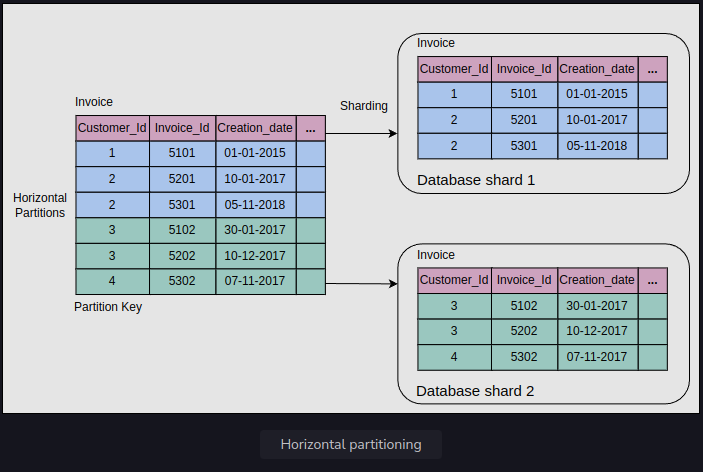

<h1>Data Partitioning</h1>

<h2>Why do we partition data?</h2>
Data is an asset for any organization. Increasing data and concurrent read/write traffic 
to the data put scalability pressure on traditional databases. As a result, the latency and throughput are affected. 
Traditional databases are attractive due to their properties such as range queries, secondary indices, 
and transactions with the ACID properties.

At some point, a single node-based database isn’t enough to tackle the load. We might need to distribute the data 
over many nodes but still export all the nice properties of relational databases. In practice, 
it has proved challenging to provide single-node database-like properties over a distributed database.

One solution is to move data to a NoSQL-like system. However, the historical codebase and its close cohesion 
with traditional databases make it an expensive problem to tackle.

Organizations might scale traditional databases by using a third-party solution. But often, 
integrating a third-party solution has its complexities. More importantly, there are abundant opportunities to optimize 
for the specific problem at hand and get much better performance than a general-purpose solution.

Data partitioning (or sharding) enables us to use multiple nodes where each node manages some part of the whole data. 
To handle increasing query rates and data amounts, we strive for balanced partitions and balanced read/write load.

<h2>Sharding</h2>
To divide load among multiple nodes, we need to partition the data by a phenomenon known as partitioning or sharding. 
In this approach, we split a large dataset into smaller chunks of data stored at different nodes on our network.

The partitioning must be balanced so that each partition receives about the same amount of data. 
If partitioning is unbalanced, the majority of queries will fall into a few partitions. 
Partitions that are heavily loaded will create a system bottleneck. The efficacy of partitioning will be harmed 
because a significant portion of data retrieval queries will be sent to the nodes that carry the highly congested partitions. 
Such partitions are known as hotspots. Generally, we use the following two ways to shard the data:
* Vertical sharding
* Horizontal sharding

<h3>Vertical sharding</h3>
We can put different tables in various database instances, which might be running on a different physical server. 
We might break a table into multiple tables so that some columns are in one table while the rest are in the other. 
We should be careful if there are joins between multiple tables. We may like to keep such tables together on one shard.

Often, vertical sharding is used to increase the speed of data retrieval from a table consisting of columns 
with very wide text or a binary large object (blob). In this case, the column with large text 
or a blob is split into a different table.

As shown in the figure a couple paragraphs below, the Employee table is divided into two tables: a reduced Employee table and an EmployeePicture table. 
The EmployePicture table has just two columns, EmployeID and Picture, separated from the original table. Moreover, 
the primary key EmpoloyeeID of the Employee table is added in both partitioned tables. This makes the data read 
and write easier, and the reconstruction of the table is performed efficiently.

Vertical sharding has its intricacies and is more amenable to manual partitioning, where stakeholders carefully decide how to partition data. 
In comparison, horizontal sharding is suitable to automate even under dynamic conditions.

<h3>Horizontal sharding</h3>
At times, some tables in the databases become too big and affect read/write latency. 
Horizontal sharding or partitioning is used to divide a table into multiple tables by splitting data row-wise, 
as shown in the figure in the next section. Each partition of the original table distributed over database servers is called a shard. 
Usually, there are two strategies available:
* Key-range based sharding
* Hash based sharding

<h4>Key-range based sharding</h4>
In the following figure, horizontal partitioning on the Invoice table is performed using the key-range based sharding with Customer_Id as the partition key. 
The two different colored tables represent the partitions.

Sometimes, a database consists of multiple tables bound by foreign key relationships. In such a case, 
the horizontal partition is performed using the same partition key on all tables in a relation. 
Tables (or subtables) that belong to the same partition key are distributed to one database shard. 
The following figure shows that several tables with the same partition key are placed in a single database shard:

The basic design techniques used in multi-table sharding are as follows:
* There’s a partition key in the Customer mapping table. 
This table resides on each shard and stores the partition keys used in the shard. 
Applications create a mapping logic between the partition keys and database shards by reading 
this table from all shards to make the mapping efficient. Sometimes, applications use advanced algorithms 
to determine the location of a partition key belonging to a specific shard.
* The partition key column, Customer_Id, is replicated in all other tables as a data isolation point. 
It has a trade-off between an impact on increased storage and locating the desired shards efficiently. 
Apart from this, it’s helpful for data and workload distribution to different database shards. 
The data routing logic uses the partition key at the application tier to map queries specified for a database shard.
* Primary keys are unique across all database shards to avoid key collision during data migration among shards 
and the merging of data in the online analytical processing (OLAP) environment.
* The column Creation_date serves as the data consistency point, with an assumption that the clocks of all nodes are synchronized. 
This column is used as a criterion for merging data from all database shards into the global view when essential.

<h5>Advantages</h5>
* Using key-range-based sharding method, the range-query-based scheme is easy to implement. 
We precisely know where (which node, which shard) to look for a specific range of keys.
* Range queries can be performed using the partitioning keys, and those can be kept in partitions in sorted order. 
How exactly such a sorting happens over time as new data comes in is implementation specific.

<h5>Disadvantages</h5>
* Range queries can’t be performed using keys other than the partitioning key.
* If keys aren’t selected properly, some nodes may have to store more data due to an uneven distribution of the traffic.

<h4>Hash-based sharding</h4>
<h5>Advantages</h5>
<h5>Disadvantages</h5>
<h4>Consistent hashing</h4>
<h5>Advantages</h5>
<h5>Disadvantages</h5>
<h3>Rebalance the partitions</h3>
<h4>Avoid hash mod n</h4>
<h4>Fixed number of partitions</h4>
<h4>Dynamic partitioning</h4>
<h4>Partition proportionally to nodes</h4>
<h3>Partitioning and secondary indexes</h3>
<h4>Partition secondary indexes by document</h4>
<h4>Partition secondary indexes by the term</h4>
<h2>Request routing</h2>
<h3>ZooKeeper</h3>
<h2>Conclusion</h2>
