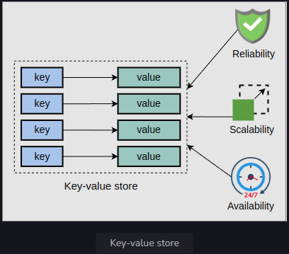

<h1>System Design: The Key-value Store</h1>

<h2>Introduction to key-value stores</h2>
Key-value stores are distributed hash tables (DHTs). A key is generated by the hash function and should be unique. 
In a key-value store, a key binds to a specific value and doesn’t assume anything about the structure of the value. 
A value can be a blob, image, server name, or anything the user wants to store against a unique key.

Usually, it’s preferred to keep the size of value relatively smaller (KB to MB). 
We can put large data in the blob store and put links to that data in the value field. 
Key-value stores are useful in many situations, such as storing user sessions in a web application and building NoSQL databases.

It’s challenging to scale traditional databases with strong consistency and high availability in a distributed environment. 
Many real-world services like Amazon, Facebook, Instagram, Netflix, and many more use primary-key access to a data store 
instead of traditional online transaction processing (OLTP) databases. Examples of key-value store usage include bestseller lists, 
shopping carts, customer preferences, session management, sales rank, and product catalogs.

Note: Many applications might not require a rich programming model provided by a traditional relational database management system (RDBMS). 
Using RDBMS for such applications is often expensive in terms of cost and performance.
