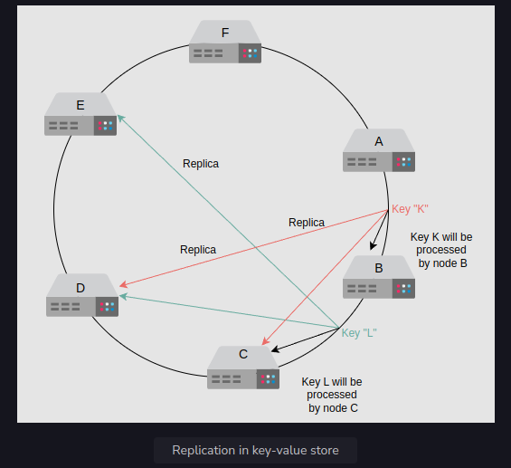

<h1>Ensure Scalability and Replication</h1>

<h2>Add scalability</h2>
Let’s start with one of the core design requirements: scalability. We store key-value data in storage nodes. 
With a change in demand, we might need to add or remove storage nodes. It means we need 
to partition data over the nodes in the system to distribute the load across all nodes.

For example, let’s consider that we have four nodes, and we want 25% of the requests to go to each node to balance the load equally. 
The traditional way to solve this is through the modulus operator. Each request that arrives has a key associated with it. 
When a request comes in, we calculate the hash of they key. Then, 
we find the remainder by taking the modulus of the hashed value with the number of nodes m. 
The remainder value x is the node number, and we send the request to that node to process it.

1. We get the hash of the key and take modulus with the number of nodes to find the node that should process the request
2. We perform the required operations on the key to get the node
3. Node 2 will process the request

We want to add and remove nodes with minimal change in our infrastructure. But in this method, 
when we add or remove a node, we need to move a lot of keys. This is inefficient. For example, node 2 is removed, 
and suppose for the same key, the new server to process a request will be node 1 because 10 % 3 = 1. 
Nodes hold information in their local caches, like keys and their values. So, 
we need to move that request’s data to the next node that has to process the request. 
But this replication can be costly and can cause high latency.

Why didn’t we use load balancers to distribute the requests to all nodes?

Load balancers distribute client requests according to an algorithm. That algorithm can be as simple as explained above, 
or it can be something detailed, as described in the next section. The next method we’ll discuss can be 
one of the ways the load balancers balance the requests across the nodes.

<h3>Consistent hashing</h3>
Consistent hashing is an effective way to manage the load over the set of nodes. In consistent hashing, 
we consider that we have a conceptual ring of hashes from 0 to n − 1, where n is the number of available hash values. 
We use each node’s ID, calculate its hash, and map it to the ring. We apply the same process to requests. 
Each request is completed by the next node that it finds by moving in the clockwise direction in the ring.

Whenever a new node is added to the ring, the immediate next node is affected. 
It has to share its data with the newly added node while other nodes are unaffected. 
It’s easy to scale since we’re able to keep changes to our nodes minimal. 
This is because only a small portion of overall keys need to move. 
The hashes are randomly distributed, 
so we expect the load of requests to be random and distributed evenly on average on the ring.

1. Consider we have a conceptual ring of hashes from 0 to n-1, where n is the total number of hash values in the ring
2. A hash for Node1 is calculated and Node1 is added to the ring
3. A hash for Node2 is calculated and Node2 is added to the ring
4. Hashes for other nodes are calculated and nodes are added to the ring
5. Similarly, a hash is calculated for the key and the request is added to the ring
6. The request is completed by the next node it finds by moving in the clockwise direction
7. The hash is calculated for the next request and the request is added to the ring
8. The request is completed by N2 since it’s the next node in the clockwise direction
9. The hash is calculated for the request and the request is added to the ring
10. The request is completed by N3 since it’s the next node in the clockwise direction
11. The hash is calculated for a new node, Node5, which is added to the ring
12. N3 shares the keys from N2 to N5 with N5
13. The hash is calculated for a new request and the request is added to the ring
14. The request is processed by N5 instead of N3 since N5 is the next node in the clockwise direction

The primary benefit of consistent hashing is that as nodes join or leave, it ensures that a minimal number of keys need to move. 
However, the request load isn’t equally divided in practice. 
Any server that handles a large chunk of data can become a bottleneck in a distributed system. 
That node will receive a disproportionately large share of data storage and retrieval requests, 
reducing the overall system performance. As a result, these are referred to as hotspots.

As shown in the figure below, most of the requests are between the N4 and N1 nodes. 
Now, N1 has to handle most of the requests compared to other nodes, and it has become a hotspot. 
That means non-uniform load distribution has increased load on a single server.

<h4>Use virtual nodes</h4>
We’ll use virtual nodes to ensure a more evenly distributed load across the nodes. 
Instead of applying a single hash function, we’ll apply multiple hash functions onto the same key.

Let’s take an example. Suppose we have three hash functions. For each node, we calculate three hashes and place them into the ring. 
For the request, we use only one hash function. Wherever the request lands onto the ring, 
it’s processed by the next node found while moving in the clockwise direction. Each server has three positions, 
so the load of requests is more uniform. Moreover, if a node has more hardware capacity than others, 
we can add more virtual nodes by using additional hash functions. This way, 
it’ll have more positions in the ring and serve more requests.

1. Calculate the hash for Node1 using Hash 1, and place the node in the ring
2. Calculate the hash for Node1 using Hash 2, and place the node in the ring
3. Calculate the hash for Node1 using Hash 3, and place the node in the ring
4. Calculate the hash for Node2 using Hash 1, and place the node in the ring
5. Calculate the hash for Node2 using Hash 2, and place the node in the ring
6. Calculate the hash for Node2 using Hash 3, and place the node in the ring
7. Calculate the hash for the request using Hash 1, and place the request in the ring
8. The request will be processed by the virtual node of Node2

<h5>Advantages of virtual nodes</h5>
Following are some advantages of using virtual nodes:
* If a node fails or does routine maintenance, the workload is uniformly distributed over other nodes. 
For each newly accessible node, the other nodes receive nearly equal load when it comes back online or is added to the system.
* It’s up to each node to decide how many virtual nodes it’s responsible for, 
considering the heterogeneity of the physical infrastructure. For example, 
if a node has roughly double the computational capacity as compared to the others, it can take more load.

We’ve made the proposed design of key-value storage scalable. The next task is to make our system highly available.

<h2>Data replication</h2>
We have various methods to replicate the storage.
It can be either a primary-secondary relationship or a peer-to-peer relationship.

<h3>Primary-secondary approach</h3>
In a primary-secondary approach, one of the storage areas is primary, and other storage areas are secondary. 
The secondary replicates its data from the primary. The primary serves the write requests while the secondary serves read requests. 
After writing, there’s a lag for replication. Moreover, if the primary goes down, we can’t write into the storage, 
and it becomes a single point of failure.

<h3>Peer-to-peer approach</h3>
In the peer-to-peer approach, all involved storage areas are primary, and they replicate the data to stay updated. 
Both read and write are allowed on all nodes. Usually, it’s inefficient and costly to replicate in all n nodes. 
Instead, three or five is a common choice for the number of storage nodes to be replicated.

We’ll use a peer-to-peer relationship for replication. We’ll replicate the data on multiple hosts to achieve durability 
and high availability. Each data item will be replicated at n hosts, where n is a parameter configured per instance 
of the key-value store. For example, if we choose n to be 5, it means we want our data to be replicated to five nodes.

Each node will replicate its data to the other nodes. We’ll call a node coordinator that handles read or write operations. 
It’s directly responsible for the keys. A coordinator node is assigned the key “K.” 
It’s also responsible for replicating the keys to n − 1 successors on the ring (clockwise). 
These lists of successor virtual nodes are called preference lists. To avoid putting replicas on the same physical nodes, 
the preference list can skip those virtual nodes whose physical node is already in the list.

Let’s consider the illustration given below. We have a replication factor, n, set to 3. For the key “K,” 
the replication is done on the next three nodes: B, C, and D. Similarly, for key “L,” the replication is done on nodes C, D, and E.

What is the impact of synchronous or asynchronous replication?
In synchronous replication, the speed of writing is slow because the data has to be replicated 
to all the nodes before acknowledging the user. 
It affects our availability, so we can’t apply it. When we opt for asynchronous replication, 
it allows us to do speedy writes to the nodes.

In the context of the CAP theorem, key-value stores can either be consistent or be available when there are network partitions. 
For key-value stores, we prefer availability over consistency. It means if the two storage nodes lost connection for replication, 
they would keep on handling the requests sent to them, and when the connection is restored, they’ll sync up. 
In the disconnected phase, it’s highly possible for the nodes to be inconsistent. So, we need to resolve such conflicts. 
In the next lesson, we’ll learn a concept to handle inconsistencies using the versioning of our data.
