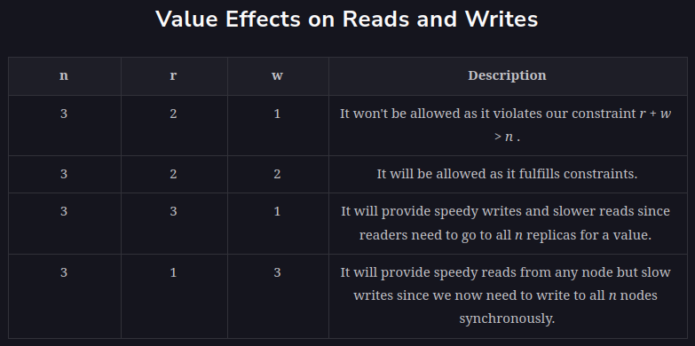

<h1>Versioning Data and Achieving Configurability</h1>

<h2>Data versioning</h2>
When network partitions and node failures occur during an update, an object’s version history might become fragmented. 
As a result, it requires a reconciliation effort on the part of the system. It’s necessary to build a way 
that explicitly accepts the potential of several copies of the same data so that we can avoid the loss of any updates. 
It’s critical to realize that some failure scenarios can lead to multiple copies of the same data in the system. 
So, these copies might be the same or divergent. Resolving the conflicts among these divergent histories is essential 
and critical for consistency purposes.
1. Two nodes replicating their data while handling requests
2. The network connection between two nodes breaks
3. Both nodes continue handling the requests
4. The connection is restored, but the data in both nodes isn’t necessarily the same

To handle inconsistency, we need to maintain causality between the events. We can do this using the timestamps 
and update all conflicting values with the value of the latest request. But time isn’t reliable in a distributed system, 
so we can’t use it as a deciding factor.

Another approach to maintaining causality effectively is by using vector clocks. A vector clock is a list of (node, counter) pairs. 
There’s a single vector clock for every version of an object. If two objects have different vector clocks, 
we’re able to tell whether they’re causally related or not (more on this in a bit). 
Unless one of the two changes is reconciled, the two are deemed at odds.

<h3>Modify the API design</h3>
We talked about how we can decide if two events are causally related or not using a vector clock value. For this, 
we need information about which node performed the operation before and what its vector clock value was. 
This is the context of an operation. So, we’ll modify our API design as follows.

The API call to get a value should look like this:
```
get(key)
```
Where key is the key against which we want to get value.

We return an object or a collection of conflicting objects along with a context. 
The context holds encoded metadata about the object, including details such as the object’s version.

The API call to put the value into the system should look like this:
```
get(key)
```
Where key is the key against which we want to get value, context - this holds the metadata for each object,
value - this is the object that needs to be stored against the key.

The function finds the node where the value should be placed on the basis of the key and stores the value associated with it. 
The context is returned by the system after the get operation. If we have a list of objects in context that raises a conflict, 
we’ll ask the client to resolve it.

To update an object in the key-value store, the client must give the context. 
We determine version information using a vector clock by supplying the context from a previous read operation. 
If the key-value store has access to several branches, it provides all objects at the leaf nodes, 
together with their respective version information in context, when processing a read request. 
Reconciling disparate versions and merging them into a single new version is considered an update.

Note: This process of resolving conflicts is comparable to how it’s done in Git. 
If Git is able to merge multiple versions into one, merging is performed automatically. 
It’s up to the client (the developer) to resolve conflicts manually if automatic conflict resolution is not possible. 
Along the same lines, our system can try automatic conflict resolution and, if not possible, 
ask the application to provide a final resolved value.

<h3>Vector clock usage example</h3>
Let’s consider an example. Say we have a write operation request. Node A handles the first version of the write request, 
E1 where E means event. The corresponding vector clock has node information and its counter—that is, [A,1]. 
Node A handles another write for the same object on which the previous write was performed. So, for E2 , we have [A,2]. 
E1 is no longer required because E2 was updated on the same node. E2 reads the changes made by E1, 
and then new changes are made. Suppose a network partition happens. Now, the request is handled by two different nodes, 
B and C. The context with updated versions, which are E3, E4, and their related clocks, which are ([A,2],[B,1]) 
and ([A,2],[C,1]), are now in the system.

Suppose the network partition is repaired, and the client requests a write again, but now we have conflicts. 
The context([A,3],[B,1],[C,1]) of the conflicts are returned to the client. After the client does reconciliation 
and A coordinates the write, we have E5 with the clock ([A,4]).

1. Let’s suppose that we have three nodes. The vector clock counter is set to 1 for all of them
2. Node A handles the first version of the write request, E1, and the vector clock counter is increased by 1
3. Node A handles the second version of the write request, E2, and the vector clock counter is increased by 2
4. Let’s suppose that a network partition happens
5. Now, the request is handled by Nodes B and C, and their respective vector clock counter is increased
6. Let’s suppose that the network has now been repaired
7. The request is sent to Node A to be processed, but now it has conflicts. We ask the client to resolve it
8. The request is updated after reconciliation

<h3>Compromise with vector clocks limitations</h3>
The size of vector clocks may increase if multiple servers write to the same object simultaneously. 
It’s unlikely to happen in practice because writes are typically handled by one of the top n nodes in a preference list.

For example, if there are network partitions or multiple server failures, 
write requests may be processed by nodes not in the top n nodes in the preference list. 
As a result we can have a long version like this:
([A,10],[B,4],[C,1],[D,2],[E,1],[F,3],[G,5],[H,7],[I,2],[J,2],[K,1],[L,1]). 
It’s a hassle to store and maintain such a long version history.

We can limit the size of the vector clock in these situations. We employ a clock truncation strategy 
to store a timestamp with each (node, counter) pair to show when the data item was last updated by the node. 
Vector clock pairs are purged when the number of (node, counter) pairs exceeds a predetermined threshold (let’s say 10). 
Because the descendant linkages can’t be precisely calculated, 
this truncation approach can lead to a lack of efficiency in reconciliation.

<h2>The get and put operations</h2>
One of our functional requirements is that the system should be configurable. 
We want to control the trade-offs between availability, consistency, cost-effectiveness, and performance. 
So, let’s achieve configurability by implementing the basic get and put functions of the key-value store.

Every node can handle the get (read) and put (write) operations in our system. A node handling a read 
or write operation is known as a coordinator. The coordinator is the first among the top n nodes in the preference list.

There can be two ways for a client to select a node:
* We route the request to a generic load balancer.
* We use a partition-aware client library that routes requests directly to the appropriate coordinator nodes.

Both approaches have their benefits. The client isn’t linked to the code in the first approach, 
whereas lower latency is achievable in the second. The latency is lower due to the reduced number of hops 
because the client can directly go to a specific server.

Let’s make our service configurable by having an ability where we can control the trade-offs between availability, 
consistency, cost-effectiveness, and performance. We can use a consistency protocol similar to those used in quorum systems.
A quorum is the minimum number of votes that a distributed transaction has to obtain in order to be allowed 
to perform an operation in a distributed system. A quorum-based technique is implemented 
to enforce consistent operation in a distributed system. (Wikipedia)

Let’s take an example. Say n in the top n of the preference list is equal to 3. 
It means three copies of the data need to be maintained. We assume that nodes are placed in a ring. 
Say A, B, C, D, and E is the clockwise order of the nodes in that ring. If the write function is performed on node A, 
then the copies of that data will be placed on B and C. 
This is because B and C are the next nodes we find while moving in a clockwise direction of the ring.

<h2>Usage of r and w</h2>
Now, consider two variables, r and w. The r means the minimum number of nodes that need to be part of a successful read operation, 
while w is the minimum number of nodes involved in a successful write operation. So if r=2, 
it means our system will read from two nodes when we have data stored in three nodes. We need to pick values of r and w
such that at least one node is common between them. This ensures that readers could get the latest-written value. 
For that, we’ll use a quorum-like system by setting r + w > n.

The following table gives an overview of how the values of n, r, and w affect the speed of reads and writes:


Let’s say n = 3, which means we have three nodes where the data is copied to. Now, for w = 2, 
the operation makes sure to write in two nodes to make this request successful. For the third node, 
the data is updated asynchronously.

1. We have a replication factor of 3 and w is 2. The key “K” will be replicated to A, B, and C
2. Since w=2, we’ll write in the first two nodes, then send an acknowledgment to the user or client
3. For the third node, we’ll write/replicate the data asynchronously

In this model, the latency of a get operation is decided by the slowest of the r replicas. 
The reason is that for the larger value of r, we focus more on availability and compromise consistency.

The coordinator produces the vector clock for the new version and writes the new version locally upon receiving a put() request for a key. 
The coordinator sends n highest-ranking nodes with the updated version and a new vector clock. 
We consider a write successful if at least w − 1 nodes respond. Remember that the coordinate writes to itself first, 
so we get w writes in total.

Requests for a get() operation are made to the n highest-ranked reachable nodes in a preference list for a key. 
They wait for r answers before returning the results to the client. Coordinators return all dataset versions 
that they regard as unrelated if they get several datasets from the same source (divergent histories that need reconciliation). 
The conflicting versions are then merged, and the resulting key’s value is rewritten to override the previous versions.

By now, we’ve fulfilled the scalability, availability, conflict-resolution, and configurable service requirements. 
The last requirement is to have a fault-tolerant system. Let’s discuss how we’ll achieve it in the next lesson.
