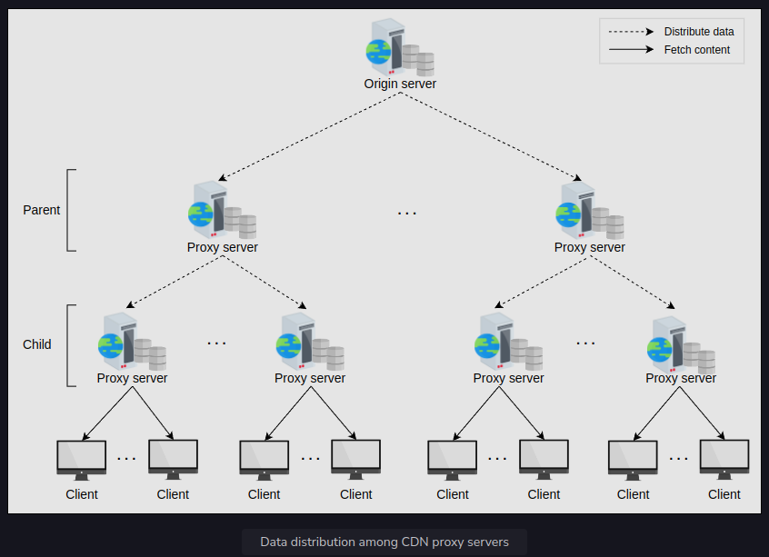
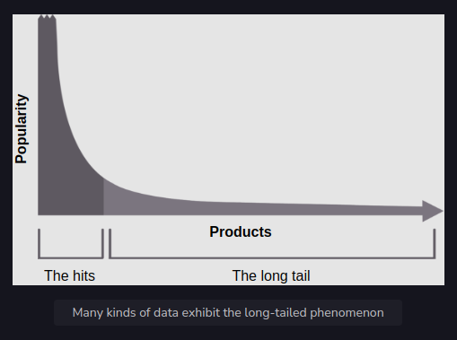

<h1>In-depth Investigation of CDN: Part 1</h1>

In this lesson, we’ll go into the details of certain concepts, such as CDN models and multi-tier/layered CDN architecture, 
that we mentioned in the previous lessons. We’ll also introduce some new concepts, 
including dynamic content caching optimization and various techniques to discover the nearby proxy servers in CDNs.

<h2>Content caching strategies in CDN</h2>
Identifying content to cache is important in delivering up-to-date and popular web content. To ensure timely updates, 
two classifications of CDNs are used to get the content from the origin servers.

<h3>Push CDN</h3>
Content gets sent automatically to the CDN proxy servers from the origin server in the push CDN model. 
The content delivery to the CDN proxy servers is the content provider’s responsibility. 
Push CDN is appropriate for static content delivery, where the origin server decides which content to deliver 
to users using the CDN. The content is pushed to proxy servers in various locations according to the content’s popularity. 
If the content is rapidly changing, the push model might struggle to keep up and will do redundant content pushes.

<h3>Pull CDN</h3>
A CDN pulls the unavailable data from origin servers when requested by a user. 
The proxy servers keep the files for a specified amount of time and then remove them from the cache 
if they’re no longer requested to balance capacity and cost.

When users request web content in the pull CDN model, the CDN itself is responsible for pulling the requested content 
from the origin server and serving it to the users. Therefore, this type of CDN is more suited for serving dynamic content.

As stated, the push CDN is mostly used for serving static content. Since static content is served 
to a wide range of users for longer than dynamic content, the push CDN scheme maintains more replicas than the pull CDN, 
thus improving availability. On the other hand, the pull CDN is favored for frequently changing content 
and a high traffic load. Low storage consumption is one of the main benefits of the pull CDN.

Note: Most content providers use both pull and push CDN caching approaches to get the benefits of both.

<h2>Dynamic content caching optimization</h2>
Since dynamic content often changes, it’s a good idea to cache it optimally. 
This section deals with the optimization of frequently changing content.

Certain dynamic content creation requires the execution of scripts that can be executed 
at proxy servers instead of running on the origin server. Dynamic data can be generated using various parameters, 
which can be beneficial if executed at the proxy servers. For example, we can generate dynamic content based on user location, 
time of day at a location, third-party APIs specific to a location (for instance, weather API), and so on. 
So, it’s optimal to run the scripts at proxy servers instead of the origin servers.

To reduce the communication between the origin server and proxy servers and storage requirements at proxy servers, 
it’s useful to employ compression techniques as well. For example, Cloudflare uses Railgun to compress dynamic content.

Another popular approach for dynamic data compression is Edge Side Includes (ESI) markup language. Usually, 
a small portion of the web pages changes in a certain time. It means fetching a full web page on 
each small change contains a lot of redundant data. To resolve this performance penalty, 
ESI specifies where content was changed so that the rest of the web page content can be cached. 
It assembles dynamic content at the CDN edge server or client browser. 
ESI isn’t standardized yet by the World Wide Web Consortium (W3C), but many CDN providers use it.

Note: Dynamic Adaptive Streaming one HTTP (DASH) uses a manifest file with URIs of the video with different resolutions 
so that the client can fetch whatever is appropriate as per prevailing network and end node conditions. 
Netflix uses a proprietary DASH version with a Byte-range in the URL for further content request and delivery optimization.

<h2>Multi-tier CDN architecture</h2>
The content provider sends the content to a large number of clients through a CDN. 
The task of distributing data to all the CDN proxy servers simultaneously is challenging and burdens the origin server significantly. 
CDNs follow a tree-like structure to ease the data distribution process for the origin server. 
The edge proxy servers have some peer servers that belong to the same hierarchy. 
This set of servers receives data from the parent nodes in the tree, which eventually receive data from the origin servers. 
The data is copied from the origin server to the proxy servers by following different paths in the tree.

The tree structure for data distribution allows us to scale our system for increasing users by adding more server nodes to the tree. 
It also reduces the burden on the origin server for data distribution. A CDN typically has one or two tiers of proxy servers (caches). 
The following illustration shows the two tiers of proxy servers:

Whenever a new proxy server enters the tree of a CDN, it requests the control core, 
which maintains information on all the proxy servers in the CDN and provides initial content with the configuration data.

Research shows that many contents have long-tail distribution. This means that, at some point, 
only a handful of content is very popular, and then we have a long tail of less popular content. 
Here, a multi-layer cache might be used to handle long-tail content.

What happens if a child or parent proxy server fails or if the origin server fails?
Each PoP contains a collection of CDN proxy servers. When any child proxy server stops working due to any failures, 
DNS can route clients to a different child-level proxy server. Each child proxy server knows many upper-layer parent servers, 
and if one fails, it can go to the other one. The origin server is a set of servers with a hot backup(s), 
and content is in replicated store. If any of the origin servers fail, other servers take the load.

<h2>Find the nearest proxy server to fetch the data</h2>
<h3>Important factors that affect the proximity of the proxy server</h3>
<h3>DNS redirection</h3>
<h3>Anycast</h3>
<h3>Client multiplexing</h3>
<h3>HTTP redirection</h3>
