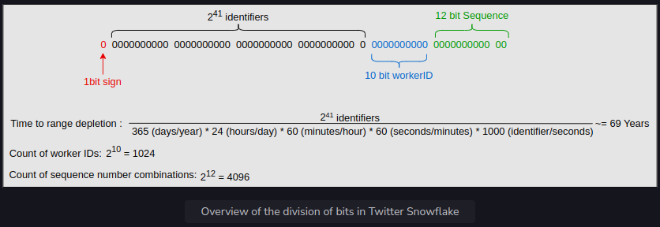
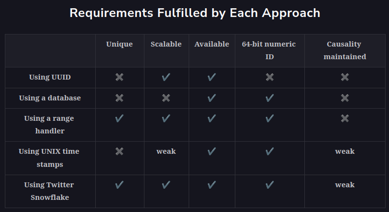
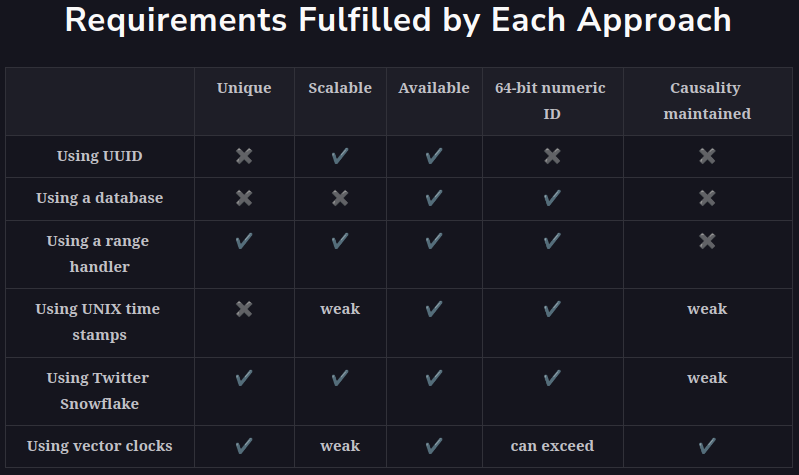
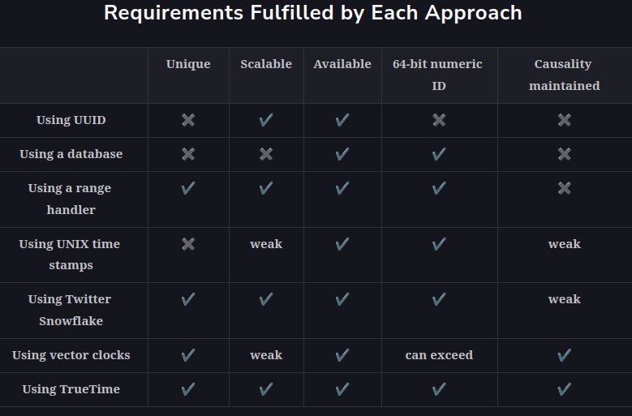

<h1>Unique IDs with Causality</h1>

<h2>Causality</h2>
In the previous lesson,we generated unique IDs to differentiate between various events. 
Apart from having unique identifiers for events, we’re also interested in finding the sequence of these events. 
Let’s consider an example where Peter and John are two Twitter users. John posts a comment (event A), 
and Peter replies to John’s comment (event B). Event B is dependent on event A and can’t happen before it. 
The events are not concurrent here.

We can also have concurrent events—that is, two events that occur independently of each other. For example, 
if Peter and John comment on two different Tweets, there’s no happened-before relationship or causality between them. 
It’s essential to identify the dependence of one event over the other but not in the case of concurrent events.

Note: The scenario described above can also be handled by assigning a unique ID and encoding the dependence 
of events using a social graph. We might also use a separate time data structure and a simple unique ID. However, 
we want a unique ID to do double duty—provide unique identification and also help with the causality of events.

Some applications need the events to have unique identifiers and carry any relevant causality information. 
An example of this is giving an identifier to the concurrent writes of a key into a key-value store 
to implement the last-write-wins strategy.

We can either use logical or physical clocks to infer causality. Some systems have additional requirements 
where we want event identifiers’ causality to map wall-clock time. An example of this is a financial application 
that complies with the European MiFID regulations. MiFID requires clocks to be within 100 microseconds of UTC 
to detect anomalies during high-volume/high-speed market trades.

Note: There are many subtleties associated with logical or physical clocks. We can refer 
to the text below titled “Time in a Distributed System” to refresh our concepts of time.

We use time to determine the sequence of events in our life. For example, if Sam took a bath at 6 a.m. 
and ate breakfast at 7:00 a.m., we can determine that Sam took a bath before breakfast by the time stamps of each event. 
Time stamps, therefore, can be used to maintain causality.

<h2>Use UNIX time stamps</h2>
UNIX time stamps are granular to the millisecond and can be used to distinguish different events. 
We have an ID-generating server that can generate one ID in a single millisecond. 
Any request to generate a unique ID is routed to that server, which returns a time stamp and then returns a unique ID. 
The ability to generate an ID in milliseconds allows us to generate a thousand identifiers per second. 
This means we can get 24(hour)∗60(min/hour)∗60(sec/min)∗1000(ID/sec)=86400000IDs in a day. 
That’s less than a billion per day.

Note: Connect to the following terminal to view the UNIX time stamp in milliseconds.

Our system works well with generating IDs, but it poses a crucial problem. The ID-generating server is a single point 
of failure (SPOF), and we need to handle it. To cater to SPOF, we can add more servers. 
Each server generates a unique ID for every millisecond. To make the overall identifier unique across the system, 
we attach the server ID with the UNIX time stamp. Then, we add a load balancer to distribute the traffic more efficiently. 

<h3>Pros</h3>
This approach is simple, scalable, and easy to implement. It also enables multiple servers to handle concurrent requests.

<h3>Cons</h3>
For two concurrent events, the same time stamp is returned and the same ID can be assigned to them. 
This way, the IDs are no longer unique.


<h2>Twitter Snowflake</h2>
Let’s try to use time efficiently. We can use some bits out of our targetted 64 bits for storing time 
and the remaining for other information. An overview of division is below:

The explanation of the bits division is as follows:
* Sign bit: A single bit is assigned as a sign bit, and its value will always be zero. It makes the overall number positive. 
Doing so helps to ensure that any programming environment using these identifiers interprets them as positive integers.
* Time stamp: 41 bits are assigned for milliseconds. The Twitter Snowflake default epoch will be used. 
Its value is 1288834974657, which is equivalent to November 4, 2010, 01:42:54 UTC. We can initiate our own epoch 
when our system will be deployed, say January 1, 2022, at 12 midnight can be the start of our epoch from zero. 
The maximum time to deplete this range is shown below:

Time to range depletion = 
2^41 identifiers / (365 days/year * 24 hours/day * 60 minutes/hour * 60 seconds/minute * 1000 identifier/sec) ~= 69 years

The above calculations give us 69 years before we need a new algorithm to generate IDs. As we saw earlier, 
if we can generate 1,000 identifiers per second, we aren’t able to get our target of a billion identifiers per day. 
Though now, in the Snowflake proposal, we have ample identifiers available when we utilize worker ID 
and machine local sequence numbers.

* Worker number: The worker number is 10 bits. It gives us 2^10 = 1,024 worker IDs. 
The server creating the unique ID for its events will attach its ID.
* Sequence number: The sequence number is 12 bits. For every ID generated on the server, 
the sequence number is incremented by one. It gives us 
2^12 = 4,096 unique sequence numbers. We’ll reset it to zero when it reaches 4,096. 
This number adds a layer to avoid duplication.

<h3>Pros</h3>
Twitter Snowflake uses the time stamp as the first component. Therefore, they’re time sortable. 
The ID generator is highly available as well.



<h3>Cons</h3>
IDs generated in a dead period are a problem. The dead period is when no request for generating an ID is made to the server. 
These IDs will be wasted since they take up identifier space. The unique range possible will deplete earlier 
than expected and create gaps in our global set of user IDs.

Can you find another shortcoming in the design shown above?
The physical clocks are unreliable. For such clocks, the error can be 17 seconds per day. 
If we measure time using these on a server, the time drifts away.

Considering a single server, we won’t be affected by the drifting away of time since all transactions land 
on a single server. But in a distributed environment, the clocks won’t remain synced.

Due to the unreliability of measuring accurate time, no matter how often we synchronize these clocks with each other 
or other clocks with accurate measurement methods, there will always be skew between the various clocks involved in a distributed system.

Another weak point of this system is its reliance on time. NTP can affect the working of this system. 
If the clock on one of the servers drifts two seconds in the future, other servers are two seconds behind. 
The NTP clock recognizes it and recalibrates its clock. Now, all serves will be aligned. However, in that drifting process, 
IDs could have been generated for a time that hasn’t occurred yet, and now we’ll have a pair of possible nonconcurrent events 
with the same time stamp. Lastly, the causality of our events won’t be maintained.

Note: The Network Time Protocol (NTP) is a networking protocol for clock synchronization between computer systems over packet-switched, 
variable-latency data networks. NTP intends to synchronize all participating computers within a few milliseconds 
of Coordinated Universal Time (UTC). It mitigates the effects of variable network latency.

Having accurate time still remains an issue. We can read a machine’s time-of-day clock with microsecond or even nanosecond resolution. 
Even with this fine-grained measurement, the risks of NTP remain. Since we can’t rely on physical clocks, 
let’s put logical clocks to use.

The following table gives an overview of the requirements that have been fulfilled using different design approaches.



<h2>Using logical clocks</h2>
We can utilize logical clocks (Lamport and vector clocks) that need monotonically increasing identifiers for events.

<h3>Lamport clocks</h3>
In Lamport clocks, each node has its counter. All of the system’s nodes are equipped with a numeric counter that begins 
at zero when first activated. Before executing an event, the numeric counter is incremented by one. The message sent 
from this event to another node has the counter value. When the other node receives the message, 
it first updates its logical clock by taking the maximum of its clock value. Then, 
it takes the one sent in a message and then executes the message.

Lamport clocks provide a unique partial ordering of events using the happened-before relationship. 
We can also get a total ordering of events by tagging unique node/process identifiers, 
though such ordering isn’t unique and will change with a different assignment of node identifiers. However, 
we should note that Lamport clocks don’t allow us to infer causality at the global level. 
This means we can’t simply compare two clock values on any server to infer happened-before relationship. 
Vector clocks overcome this shortcoming.

<h3>Vector clocks</h3>
Vector clocks maintain causal history—that is, all information about the happened-before relationships of events. So, we must choose an efficient data structure to capture the causal history of each event.

Consider the design shown below. We’ll generate our ID by concatenating relevant information, just like the Twitter snowflake, with the following division:
* Sign bit: A single bit is assigned as a sign bit, and its value will always be zero.
* Vector clock: This is 53 bits and the counters of each node.
* Worker number: This is 10 bits. It gives us 2^{10} = 1,024 worker IDs.

The following slides explain the unique ID generation using vector clocks, where the nodes A, B, and C reside in a data center.

Note: In the following slides, we haven’t converted the data to bits for the sake of understanding. The pattern we’ll use for the unique ID is the following:

```
[vector-clock][worker-id]
```

1. No event is currently in progress
2. Unique ID for A1: [1,0,0][A]
3. Unique ID for C1: [0,0,1][C]
4. Unique ID for B1: [1,1,0][B]
5. No new ID needs to be assigned
6. Unique ID for C2: [0,0,2][C]
7. Unique ID for B2: [1,2,0][B]
8. Unique ID for A2: [2,0,0][A]
9. Unique ID for C3: [0,0,3][C]
10. No new ID needs to be assigned
11. Unique ID for C4: [1,1,4][C]
12. Unique ID for C5: [1,1,5][C]
13. Unique ID for A3: [3,1,5][A]
14. No new ID needs to be assigned

Our approach with vector clocks works. However, in order to completely capture causality, a vector clock must be 
at least n nodes in size. As a result, when the total number of participating nodes is enormous, 
vector clocks require a significant amount of storage. Some systems nowadays, such as web applications, 
treat every browser as a client of the system. Such information increases the ID length significantly, 
making it difficult to handle, store, use, and scale.



Would a global clock help solve our problem?

However, if we have a global clock that gives us time upon request and is always accurate, 
then we can maintain the causality of events, as well as a unique ID. Such a clock would be significantly valuable, 
but time is tricky to handle in distributed systems.

<h2>TrueTime API</h2>
Google’s TrueTime API in Spanner is an interesting option. Instead of a particular time stamp, it reports an interval of time. 
When asking for the current time, we get back two values: the earliest and latest ones. 
These are the earliest possible and latest possible time stamps.

Based on its uncertainty calculations, the clock knows that the actual current time is somewhere within that interval. 
The width of the interval depends, among other things, 
on how long it has been since the local quartz clock was last synchronized with a more accurate clock source.

Google deploys a GPS receiver or atomic clock in each data center, and clocks are synchronized within about 7 ms. 
This allows Spanner to keep the clock uncertainty to a minimum. The uncertainty of the interval is represented as epsilon.

The following slides explain how TrueTime’s time master servers work with GPS and atomic clocks in multiple data centers.

1. In every data center, we have time handlers. GPS timemasters have GPS receivers attached, and few of them have atomic clocks
2. A client needs a TrueTime
3. A client runs a daemon. The daemon contacts mostly GPS time masters 
and sometimes will contact atomic clock time masters to get the redundancy of different time references
4. We run Marzullo's algorithm, which intersects time intervals to determine a time reference. 
The API gives an interval from earliest to latest
5. The time reference will express a given interval as plus or minus epsilon

<h3>Pros</h3>
TrueTime satisfies all the requirements. We’re able to generate a globally unique 64-bit identifier. 
The causality of events is maintained. The approach is scalable and highly available.

<h3>Cons</h3>
If two intervals overlap, then we’re unsure in what order A and B occurred. 
It’s possible that they’re concurrent events, but a 100% guarantee can’t be given. 
Additionally, Spanner is expensive because it ensures high database consistency. 
The dollar cost of a Spanner-like system is also high due to its elaborate infrastructure needs and monitoring.

The updated table provides the comparison between the different system designs for generating a unique ID.



<h2>Summary</h2>
* We want to avoid duplicate identifiers. Consider what will happen if duplicate payment or purchase orders are generated.
* UUIDs provide probabilistic guarantees about the keys’ non-collision. Deterministically getting non-collision guarantees 
might need consensus among different distributed entities or stores and read from the replicated store.
* As key length becomes large, it often causes slower tuple updates in a database. 
Therefore, identifiers should be big enough but not too big.
* Often, it’s desirable that no one is able to guess the next ID. Otherwise, undesirable data leaks can happen, 
and the organization’s competitors may learn how many orders were processed in a day by simply looking at order IDs. 
Adding a few random numbers to the bits of the identifier make it hard to guess, although this comes at a performance cost.
* We can use simple counters for generating unique IDs if we don’t want to relate ID to time. 
Fetching time stamps is slower than simple counters.
* We can just use simple counters for generating unique IDs if we don’t want to relate ID to time. 
Fetching time stamps is slower than simple counters, though this requires that we store generated IDs persistently. 
The counter needs to be stored in the database. Storage comes with its own issues. These include multiple concurrent 
writes becoming overwhelming for the database and the database being the single point of failure.
* For some distributed databases, such as Spanner, it can hurt to generate monotonically increasing or decreasing IDs. 
Google reports the following: “In fact, using monotonically increasing (or decreasing) values 
* as row keys does not follow best practices in Spanner because it creates hotspots in the database, 
* leading to a reduction in performance.”

Note: Globally ordering events is an expensive procedure. A feature that was fast 
and simple in a centralized database (auto-increment based ID) becomes slow and complicated in its distributed counterpart 
due to some fundamental constraints (such as consensus, which is difficult among remote entities).

For example, Spanner, a geographically distributed database, reports that “if a read-update transaction on a single cell 
(one column in a single row) has a latency of 10 milliseconds (ms), then the maximum theoretical frequency of issuing 
of sequence values is 100 per second. This maximum applies to the entire database, regardless of the number 
of client application instances, or the number of nodes in the database. This is because a single node always manages 
a single row.” If we could compromise on the requirements for global orderings and gapless identifiers, 
we would be able to get many identifiers in a shorter time, that is, a better performance.
