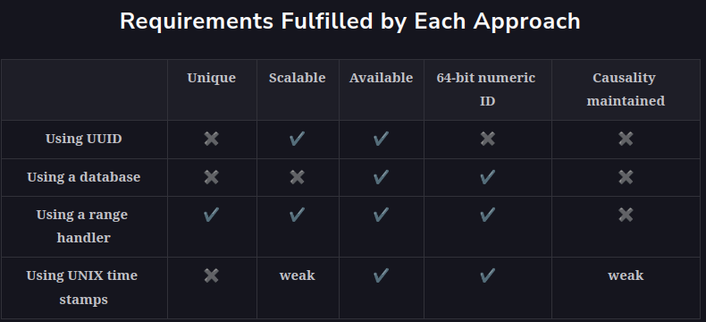

<h1>Unique IDs with Causality</h1>

<h2>Causality</h2>
In the previous lesson,we generated unique IDs to differentiate between various events. 
Apart from having unique identifiers for events, we’re also interested in finding the sequence of these events. 
Let’s consider an example where Peter and John are two Twitter users. John posts a comment (event A), 
and Peter replies to John’s comment (event B). Event B is dependent on event A and can’t happen before it. 
The events are not concurrent here.

We can also have concurrent events—that is, two events that occur independently of each other. For example, 
if Peter and John comment on two different Tweets, there’s no happened-before relationship or causality between them. 
It’s essential to identify the dependence of one event over the other but not in the case of concurrent events.

Note: The scenario described above can also be handled by assigning a unique ID and encoding the dependence 
of events using a social graph. We might also use a separate time data structure and a simple unique ID. However, 
we want a unique ID to do double duty—provide unique identification and also help with the causality of events.

Some applications need the events to have unique identifiers and carry any relevant causality information. 
An example of this is giving an identifier to the concurrent writes of a key into a key-value store 
to implement the last-write-wins strategy.

We can either use logical or physical clocks to infer causality. Some systems have additional requirements 
where we want event identifiers’ causality to map wall-clock time. An example of this is a financial application 
that complies with the European MiFID regulations. MiFID requires clocks to be within 100 microseconds of UTC 
to detect anomalies during high-volume/high-speed market trades.

Note: There are many subtleties associated with logical or physical clocks. We can refer 
to the text below titled “Time in a Distributed System” to refresh our concepts of time.

We use time to determine the sequence of events in our life. For example, if Sam took a bath at 6 a.m. 
and ate breakfast at 7:00 a.m., we can determine that Sam took a bath before breakfast by the time stamps of each event. 
Time stamps, therefore, can be used to maintain causality.

<h2>Use UNIX time stamps</h2>
UNIX time stamps are granular to the millisecond and can be used to distinguish different events. 
We have an ID-generating server that can generate one ID in a single millisecond. 
Any request to generate a unique ID is routed to that server, which returns a time stamp and then returns a unique ID. 
The ability to generate an ID in milliseconds allows us to generate a thousand identifiers per second. 
This means we can get 24(hour)∗60(min/hour)∗60(sec/min)∗1000(ID/sec)=86400000IDs in a day. 
That’s less than a billion per day.

Note: Connect to the following terminal to view the UNIX time stamp in milliseconds.

Our system works well with generating IDs, but it poses a crucial problem. The ID-generating server is a single point 
of failure (SPOF), and we need to handle it. To cater to SPOF, we can add more servers. 
Each server generates a unique ID for every millisecond. To make the overall identifier unique across the system, 
we attach the server ID with the UNIX time stamp. Then, we add a load balancer to distribute the traffic more efficiently. 

<h3>Pros</h3>
This approach is simple, scalable, and easy to implement. It also enables multiple servers to handle concurrent requests.

<h3>Cons</h3>
For two concurrent events, the same time stamp is returned and the same ID can be assigned to them. 
This way, the IDs are no longer unique.

<h2>Twitter Snowflake</h2>
<h3>Pros</h3>
<h3>Cons</h3>
<h2>Using logical clocks</h2>
<h3>Lamport clocks</h3>
<h3>Vector clocks</h3>
<h2>TrueTime API</h2>
<h3>Pros</h3>
<h3>Cons</h3>
<h2>Summary</h2>
