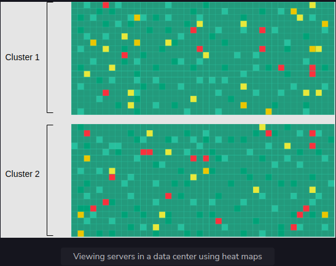

<h1>Visualize Data in a Monitoring System</h1>

<h2>Using heat maps to troubleshoot</h2>
We’ll identify if a server is down by using heat maps. Each rack of servers is named and is sorted by data center, 
then cluster, then row, so problems common at any of these levels are readily apparent.

A heat map depicting the operational state of a large number of components is an effective method. 
The health of each component is indicated by the color of each cell in a big matrix. 
Nodes with green cells operate within permitted parameters, while nodes with red cells are nonresponsive on multiple tries.

Below, we have a heat map displaying the server’s state.

We can use heat maps for the globally distributed systems and continuously share the health information of a server. 
We can use one bit (one for live, zero for dead). For 1,000,000 servers, we have 125 KB of data. 
We can quickly find out which server is down by the red color and focus on the problematic parts.

We can create similar heat maps to get a bird’s-eye view of any resource, like filesystems, 
networking switches, links, and so on.

<h2>Summary</h2>
* Monitoring systems are critical in distributed systems because they help in analyzing the system 
and alerting the stakeholders if a problem occurs.
* We can make a monitoring system scalable using a hybrid of the push and pull methods.
* Heat maps are a powerful tool for visualization and help us learn about the health of thousands 
of servers in a compact space.
