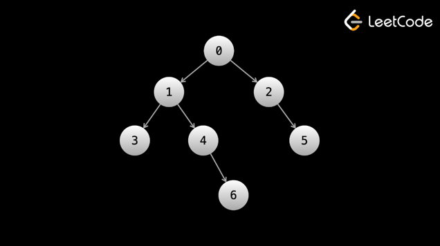

# Binary trees - DFS
+ [Maximum Depth of Binary Tree](#maximum-depth-of-binary-tree)
+ [Path Sum](#path-sum)
+ [Count Good Nodes in Binary Tree](#count-good-nodes-in-binary-tree)
+ [Same Tree](#same-tree)
+ [Lowest Common Ancestor of a Binary Tree](#lowest-common-ancestor-of-a-binary-tree)

Before starting this article, please make sure you have a complete understanding of what a binary tree is 
and how it is represented in code, as well as a solid understanding of recursion.

In this article, we'll talk about how to traverse binary trees. Tree traversal is how we access the elements of a tree, 
and thus is mandatory for solving tree problems.

Recall that in the linked list chapter, we traversed a linked list using the following code:

```python
def get_sum(head):
    ans = 0
    while head:
        ans += head.val
        head = head.next
    
    return ans
```

The above code starts at the head and visits each node to find the sum of all values in the linked list.

For each node, there is a moment in the code execution where the head variable is referencing the node. 
We traverse by using the .next attribute.

Traversing a binary tree follows the same idea. We start at the root and traverse by using the child pointers .left and .right. 
When traversing linked lists, we usually do it iteratively. With binary trees, we usually do it recursively.

There are two main types of tree traversals. The first is called depth-first search (DFS). For binary trees specifically, 
there are 3 ways to perform DFS - preorder, inorder, and postorder (don't worry though, the type you choose rarely matters). 
The other main type of traversal is called breadth-first search (BFS). Let's start by looking at DFS.

<h3>Depth-first search (DFS)</h3>
Recall that the depth of a node is its distance from the root.

In a DFS, we prioritize depth by traversing as far down the tree as possible in one direction (until reaching a leaf node) 
before considering the other direction. For example, let's say we choose left as our priority direction. 
We move exclusively with node.left until the left subtree has been fully explored. Then, we explore the right subtree.

Trees are named as such because they resemble real-life trees. 
You can think of the paths of a binary tree as branches growing from the root. DFS chooses a branch and goes as far down as possible. 
Once it fully explores the branch, it backtracks until it finds another unexplored branch.

Because we need to backtrack up the tree after reaching the end of a branch, DFS is typically implemented using recursion, 
although it is also sometimes done iteratively using a stack. Here is a simple example of recursive DFS to visit every node:

Each call to dfs(node) is visiting that node. As you can see in the code, 
we visit the left child before visiting the right child.

```python
def dfs(node):
    if node == None:
        return

    dfs(node.left)
    dfs(node.right)
    return

```

If you're having trouble understanding how we move back up the tree, 
please see the "Introduction to recursion" article in the first chapter.

You should also be comfortable with the idea that during the DFS, 
many calls to dfs exist simultaneously with their own versions of node.

The good news is that the structure for performing a DFS is very similar across all problems. It goes as follows:
1. Handle the base case(s). Usually, an empty tree (node = null) is a base case.
2. Do some logic for the current node
3. Recursively call on the current node's children
4. Return the answer

As we will see in a moment, steps 2 and 3 may happen in different orders.

The most important thing to understand when it comes to solving binary tree problems is that each function call solves 
and returns the answer to the original problem as if the subtree rooted at the current node was the input. 
The logic that will be done at each call (step 2) will depend on the problem.

We mentioned that there are three types of DFS. Each of the three types differs only in the order that they execute steps 2/3.

Let's take a look at the types now, using the following tree as a talking point:



<h4>Preorder traversal</h4>
In preorder traversal, logic is done on the current node before moving to the children. Let's say that we wanted 
to just print the value of each node in the tree to the console. In that case, at any given node, 
we would print the current node's value, then recursively call the left child, then recursively call the right child.

```python
def preorder_dfs(node):
    if not node:
        return

    print(node.val)
    preorder_dfs(node.left)
    preorder_dfs(node.right)
    return

```

Running the above code on the example tree, we would see the nodes printed in this order: 0, 1, 3, 4, 6, 2, 5.

Because the logic (printing) is done immediately at the start of each function call, 
preorder handles nodes in the same order that the function calls happen.

<h4>Inorder traversal</h4>
For inorder traversal, we first recursively call the left child, then perform logic (print in this case) on the current node, 
and then recursively call the right child. This means no logic will be done until we reach a node without a left child 
since calling on the left child takes priority over performing logic.

```python
def inorder_dfs(node):
    if not node:
        return

    inorder_dfs(node.left)
    print(node.val)
    inorder_dfs(node.right)
    return

```

Running the above code on the example tree, we would see the nodes printed in this order: 3, 1, 4, 6, 0, 2, 5.

Notice that for any given node, its value is not printed until all values in the left subtree are printed, 
and values in its right subtree are not printed until after that.

<h4>Postorder traversal</h4>
In postorder traversal, we recursively call on the children first and then perform logic on the current node. 
This means no logic will be done until we reach a leaf node since calling on the children takes priority over performing logic. 
In a postorder traversal, the root is the last node where logic is done.

```python
def postorder_dfs(node):
    if not node:
        return

    postorder_dfs(node.left)
    postorder_dfs(node.right)
    print(node.val)
    return

```

Running the above code on the example tree, we would see the nodes printed in this order: 3, 6, 4, 1, 5, 2, 0.

Notice that for any given node, no values in its right subtree are printed until all values in its left subtree are printed, 
and its own value is not printed until after that.

The name of each traversal is describing when the current node's logic is performed.

Pre -> before children

In -> in the middle of children

Post -> after children

<h2>Solving problems with DFS</h2>
If you're worried about needing to know three different types of DFS, don't worry. 
If you're using recursion (which you should be), then switching between the three types is trivial.

In many problems, the type of DFS used doesn't even matter, it's just important that all nodes are visited. 
Knowing the differences between the three types of DFS is mostly good for trivia.

Let's look at some example binary tree problems that can be solved with DFS.

### Maximum Depth of Binary Tree
<h4>Example 1: 104. Maximum Depth of Binary Tree</h4>
https://leetcode.com/problems/lowest-common-ancestor-of-a-binary-tree/

Given the root of a binary tree, find the length of the longest path from the root to a leaf.

Let's start with a recursive approach. When thinking about designing recursive functions, 
a good starting point is always the base case. What is the depth of an empty tree (zero nodes, 
root is null)? The depth is 0.

Note: earlier, we said that the depth of the root is 0. This is the usual definition, 
but in this specific LeetCode problem, the depth for the root is defined as 1 (it's asking 
for how many nodes are on the path from the root to a leaf), and we need to include the root on this path, 
hence why we start at 1.

Next, we should think about the relationship between the current node and its children. 
The problem states that we are looking for a path from the root to a leaf, which means that at the current node, 
we can only consider either the left or right subtree, not both. If maxDepth(node.left) represents the maximum depth 
of the left subtree and maxDepth(node.right) represents the maximum depth of the right subtree, 
then we should take the greater value and add 1 to it (because the current node contributes 1 to the depth).

To solve binary tree problems, you must think recursively.

The root given to you is a binary tree, but the children of the root are also binary trees. 
The children of those children are also binary trees. Every node's subtree is a binary tree.

The function provided to us maxDepth(root) takes a binary tree as an input and returns the maximum depth - we must implement it. 
If you give it an empty tree null, then it should return 0 - there are no nodes to form any paths.

Otherwise, we have a non-empty binary tree root. As stated by the problem, 
we need to find the "length of the longest path from the root to a leaf". Well, because the path needs to start at the root, 
then root will definitely be part of the path. Therefore, the current node will contribute 1 toward the answer. 
Now, we need to find a leaf.

Because of how maxDepth is defined, if we call maxDepth(root.left), 
it should give us the "length of the longest path from the left child to a leaf". 
That's perfect! Whatever that path is, we can just follow it to give us an answer of 1 + maxDepth(root.left). 
The same logic applies to maxDepth(root.right). We should choose the maximum length between the two children.

So how does this actually work in the code? We initially call maxDepth(root), where root is the actual root of the tree. 
DFS will move down the tree until it reaches a leaf. A leaf has no children, 
so both calls to the left and right will hit the base case and return 0. 
This makes the call to the leaf return 1 + max(0, 0) = 1.

This makes sense - if you take a leaf and treat it as a subtree, then the answer for this subtree would just be 1.

After we return 1 from the leaf, we will be back at the parent of the leaf. If the leaf was the left child, 
we will have a value of 1 for the left subtree (which was only the leaf). Let's say that there is no right subtree, 
so that call returns 0. Now, the answer for the parent is 1 + max(1, 0) = 2.

The + 1 that we perform at each node propagates upwards from the leaves.

Please watch the video below carefully if you are still confused.

```python
# Definition for a binary tree node.
# class TreeNode:
#     def __init__(self, val=0, left=None, right=None):
#         self.val = val
#         self.left = left
#         self.right = right

class Solution:
    def maxDepth(self, root: Optional[TreeNode]) -> int:
        if not root:
            return 0
        
        left = self.maxDepth(root.left)
        right = self.maxDepth(root.right)
        return max(left, right) + 1

```

A really important concept regarding recursion is that each function call stores its own variables. 
Because we are calling the function for each node, that means every node has its own unique values of left and right (in the video, 
we are representing this with the L and R at each node). When we get to the node labeled 6, 
there are actually 4 different values of left simultaneously.

It's that simple! Thinking recursively takes some time to get the hang of, but hopefully with the examples in this article, 
you will gain the intuition needed to quickly solve binary tree problems.

What about an iterative implementation?

In the solution above, we are doing a postorder traversal because the logic 
for the current node (basically just the return statement) happens after the calls. All three types of DFS can be implemented iteratively, 
but postorder and inorder are more complicated to implement than preorder (which is very easy). As we mentioned earlier, 
for most problems, the type of DFS doesn't matter, so we'll take a look at a preorder DFS implemented iteratively.

To implement DFS iteratively, we need to use a stack. We don't have the return values to store the depths, 
so we will instead need to associate the current depth with each node on the stack. 
The method for pairing the values will depend on the language you are using. Of the most popular languages, 
it's easiest in Python as you can just store tuple literals in the stack. In other languages like Java, 
you need to use two stacks or create a pair object or some other method.

The code format for implementing DFS iteratively is also very similar across most problems, 
as you'll see in the next few examples.

```python
# Definition for a binary tree node.
# class TreeNode:
#     def __init__(self, val=0, left=None, right=None):
#         self.val = val
#         self.left = left
#         self.right = right

class Solution:
    def maxDepth(self, root: Optional[TreeNode]) -> int:
        if not root:
            return 0
        
        stack = [(root, 1)]
        ans = 0
        
        while stack:
            node, depth = stack.pop()
            ans = max(ans, depth)
            if node.left:
                stack.append((node.left, depth + 1))
            if node.right:
                stack.append((node.right, depth + 1))
        
        return ans

```

This iterative implementation may be more intuitive if you are not used to recursion.

We are simply associating each node with its depth. For a given node with a depth of depth, 
the depth of the children will be depth + 1.

The format for performing the traversal with the stack is something that can be easily re-used between problems. 
We make use of a stack and use a while loop until the stack is empty. In each iteration of the while loop, 
we handle a single node - this is equivalent to a given function call in the recursive implementation. 
All the logic that is done in the function should be done in the while loop, including handling the children, 
which is done by pushing to the stack.

The time and space complexity of tree questions is usually straightforward. The time complexity is almost always O(n), 
where n is the total number of nodes, because each node is only visited once, and at each node, O(1) work is done. 
If more than O(1) work is done at each node, let's say O(k) work, then the time complexity will be O(n⋅k).

For space complexity, even if you are using recursion, the calls are still placed on the call stack which counts as extra space. 
The largest the stack will be (for either iterative or recursive) at any time will depend on the tree. For recursion, 
in the worst case it is O(n) if the tree is just a straight line, so usually, the correct answer to give for space complexity is O(n). 
If the tree is "complete" (all nodes have 0 or 2 children and each level except the last is full), then the space complexity is O(logn), 
but this is a best-case scenario.

Important note regarding iterative implementations: in the code, we are adding node.left before node.right. 
Popping from a stack removes the most recently added element, thus we are actually visiting the right subtree first in the above code. 
In the recursive implementations, we visit the left subtree first. This difference is irrelevant in this problem because the only thing that matters is 
that we visit all nodes, regardless of order. However, it is still good to understand that when working iteratively, 
the visit order is opposite the insertion order.

### Path Sum
<h4>Example 2: 112. Path Sum</h4>
https://leetcode.com/problems/path-sum/

Given the root of a binary tree and an integer targetSum, return true if there exists a path 
from the root to a leaf such that the sum of the nodes on the path is equal to targetSum, and return false otherwise.

First, what information do we need at each function call? We need the current node, 
but do we need anything else? If we also keep an integer curr that represents the current sum of the nodes 
from the root to the current node, we can check this value against targetSum when we find a leaf. 
Thus, let's have a helper function dfs(node, curr) that returns true if there is a path starting at node 
and ending at a leaf with a sum equal to targetSum, if we already have curr contributed towards the sum.

What are the base cases? First of all, if we have an empty tree, we can't have a path as there are no nodes, 
so return false. If we are at a leaf node (which we can check by seeing if both children are null), 
then return (curr + node.val) == targetSum.

Otherwise, if we are not at a leaf, we could either continue down the left path or the right path. 
We only need one path to equal targetSum, so return true if either works. 
Don't forget to add the current node's value to curr.

When we encounter a leaf, we need to know the sum of the values from the root to this leaf. 
We use an additional argument curr in our DFS function to keep track of this path sum.

At any given node, we make the following observation: all possible paths that start at the root 
and move through a child of node must pass through node.

Therefore, the first thing we do after checking the base cases is perform curr += node.val. 
Because every call has its own version of curr and we perform this addition at every node, it will always be accurate.

This allows us to easily check for the condition described in the problem. 
When we encounter a leaf node (which we can check for by seeing if both children are null), 
we check if (curr + node.val) == targetSum. If so, we return true.

Calling dfs(node.left, curr) returns a boolean indicating if there exists a path starting 
from node.left and ending at a leaf with a sum of targetSum, starting with curr. 
Simply put, it tells us if an answer can be found by using the left subtree. 
The same logic applies to dfs(node.right, curr).

Because the problem is asking if any path exists, 
we return true from a call if either child's call returns true (we use OR ||).

As we are using ||, any return true will eventually propagate up to the root. 
If the base case described earlier (being at a leaf and (curr + node.val) == targetSum) is satisfied, 
it will return true and cause the original call (to the root) to return true as well.

```python
class Solution:
    def hasPathSum(self, root: Optional[TreeNode], targetSum: int) -> bool:
        def dfs(node, curr):
            if not node:
                return False
            
            # if both children are null, then the node is a leaf
            if node.left == None and node.right == None:
                return (curr + node.val) == targetSum
            
            curr += node.val
            left = dfs(node.left, curr)
            right = dfs(node.right, curr)
            return left or right
        
        return dfs(root, 0)

```

Here's the iterative approach (remember that iterative is much less common 
and should only be used if an interviewer asks for it):

```python
class Solution:
    def hasPathSum(self, root: Optional[TreeNode], targetSum: int) -> bool:
        if not root:
            return False

        stack = [(root, 0)]
        while stack:
            node, curr = stack.pop()
            # if both children are null, then the node is a leaf
            if node.left == None and node.right == None:
                if (curr + node.val) == targetSum:
                    return True

            curr += node.val
            if node.left:
                stack.append((node.left, curr))
            if node.right:
                stack.append((node.right, curr))

        return False

```

Again, the time and space complexity are both O(n), where n is the number of nodes in the tree, 
as each node is visited at most once and each visit involves constant work. 
In the worst case scenario for space (straight line), the recursion call stack will grow 
to the same size as the number of nodes in the tree.

### Count Good Nodes in Binary Tree
<h4>Example 3: 1448. Count Good Nodes in Binary Tree</h4>
https://leetcode.com/problems/count-good-nodes-in-binary-tree/

Given the root of a binary tree, find the number of nodes that are good. A node is good if the path between the root 
and the node has no nodes with a greater value.

Again, let's start by thinking about what information we need at each function call (other than the node). 
At each node, we want to know if the node is good, and to know if the node is good, 
we need to know the largest value between the root and the node. Let's use an integer maxSoFar to store this.

Then, we can have a function dfs(node, maxSoFar) that returns the number of good nodes in the subtree rooted at node, 
where the maximum number seen so far is maxSoFar.

What is the base case? If we have an empty tree, then the answer is 0 because there are no nodes, 
so there are no good nodes.

The total good nodes in a subtree is the number of good nodes in the left subtree + the number 
of good nodes in the right subtree + 1 if the current node is a good node. If node.val >= maxSoFar, 
that means the current node is a good node. Then we also need to find how many good nodes are in the left 
and right subtrees, which we can do by making recursive calls while updating maxSoFar.

In the previous example, we used an argument curr to indicate the current path sum. 
We saw that every function call had its own version of curr.

In this problem, we need to know the maximum value seen so far on the current path. 
We can use an argument maxSoFar to indicate this.

Recall the observation we made in the previous example: all possible paths that start at the root 
and move through a child of node must pass through node.

This observation implies that for any given node, paths starting at the root and ending 
in the subtree of node must include node. Therefore we should update maxSoFar with node.val before calling on the children. 
By performing this update, we ensure that maxSoFar is accurate at every node.

We have dfs(node, maxSoFar) return the number of good nodes in the subtree rooted at node, 
with maxSoFar being the greatest value seen so far. 
The number of good nodes is the number of good nodes in the left subtree plus the number of good nodes in the right subtree. 
We can find these easily by calling dfs on node.left and node.right. Additionally, if the current node is a good node, 
we count it as well. We can check this by checking node.val against maxSoFar.

```python
class Solution:
    def goodNodes(self, root: TreeNode) -> int:
        def dfs(node, max_so_far):
            if not node:
                return 0
            
            left = dfs(node.left, max(max_so_far, node.val))
            right = dfs(node.right, max(max_so_far, node.val))
            ans = left + right
            if node.val >= max_so_far:
                ans += 1

            return ans

        return dfs(root, float("-inf"))

```

Here's the iterative approach:

```python
class Solution:
    def goodNodes(self, root: TreeNode) -> int:
        if not root:
            return 0
        
        stack = [(root, float("-inf"))]
        ans = 0
        
        while stack:
            node, max_so_far = stack.pop()
            if node.val >= max_so_far:
                ans += 1
            
            if node.left:
                stack.append((node.left, max(max_so_far, node.val)))
            if node.right:
                stack.append((node.right, max(max_so_far, node.val)))
        
        return ans

```

The time and space complexity are both O(n) for the exact same reasons as the previous examples.

### Same Tree
<h4>Example 4: 100. Same Tree</h4>
https://leetcode.com/problems/same-tree/

Given the roots of two binary trees p and q, check if they are the same tree. 
Two binary trees are the same tree if they are structurally identical and the nodes have the same values.

This problem really demonstrates the recursive nature of binary trees.

If p and q are the same tree, then the following is true:
1. p.val = q.val
2. p.left and q.left are the same tree
3. p.right and q.right are the same tree

The main idea is that if any two trees are the same, then their subtrees must also be the same. 
This gives us a recursive definition of the problem. Because the function we are trying to implement is supposed 
to tell us if two trees are the same, we can use the function itself to answer conditions 2 and 3.

The following condition can be used to check if p and q are the same tree:

p.val == q.val && isSameTree(p.left, q.left) && isSameTree(p.right, q.right)

Now, we need base cases so that the recursion eventually terminates. If p and q are both null, 
then we can return true, because they are technically both the same (empty) tree. If either p or q is null but not the other, 
we should return false, as they are clearly not the same tree.

A good way to think about base cases is to think about a tree with only one node. 
Let's say that p and q are both one-node trees with the same value. The first boolean check p.val == q.val passes, 
so now we check the subtrees. Because the nodes don't have children, then both calls to the left 
and right subtrees will trigger the base case and return true.

This is the beauty of recursion - if you're at the root, the left and right subtrees could have thousands of nodes. 
The process of actually going through the trees will have many cascading calls, 
but you don't need to worry about it - you know that simply making the call will give you the answer you need.

```python
class Solution:
    def isSameTree(self, p: TreeNode, q: TreeNode) -> bool:
        if p == None and q == None:
            return True
        
        if p == None or q == None:
            return False
        
        if p.val != q.val:
            return False
        
        left = self.isSameTree(p.left, q.left)
        right = self.isSameTree(p.right, q.right)
        return left and right

```

Here's an iterative approach. Notice that we are using the exact same code to check the cases. 
Instead of returning true during the traversal, we return false if any condition is broken, 
and then return true at the end if we managed to get through the trees without returning false.

```python
class Solution:
    def isSameTree(self, p: TreeNode, q: TreeNode) -> bool:
        stack = [(p, q)]
        while stack:
            p, q = stack.pop()
            if p == None and q == None:
                continue
            
            if p == None or q == None:
                return False
            
            if p.val != q.val:
                return False
            
            stack.append((p.left, q.left))
            stack.append((p.right, q.right))
            
        return True

```

Again, the time and space complexity are both O(n) for the same reasons as the other examples.

### Lowest Common Ancestor of a Binary Tree
<h4>Bonus example: 236. Lowest Common Ancestor of a Binary Tree</h4>
https://leetcode.com/problems/lowest-common-ancestor-of-a-binary-tree/

Given the root of a binary tree and two nodes p and q that are in the tree, 
return the lowest common ancestor (LCA) of the two nodes. The LCA is the lowest node in the tree that has both p 
and q as descendants (note: a node is a descendant of itself).

This problem is a classic one and a bit trickier than the ones we have already looked at. Again, 
we want our recursive function to return the answer to the question. What is the base case? If we have an empty tree, 
then no LCA exists - return null.

Otherwise, how can we tell if a node is the LCA? Let's say that we are at the root, then there are 3 possibilities.

1. The root node is p or q. The answer cannot be below the root node, 
because then it would be missing the root (which is either p or q) as a descendant.
2. One of p or q is in the left subtree, and the other one is in the right subtree. 
The root must be the answer, because it is the connection point between the two subtrees, 
and thus the lowest node to have both p and q as descendants.
3. Both p and q are in one of the subtrees. In that case, the root is not the answer 
because we could look inside the subtree and find a "lower" node.

Remember: because of the recursive natures of trees, we can translate the cases into an algorithm. 
We just need to figure out how to find the answer if it is the first or third case.

In the first case, if we see that the current node is either p or q, we don't need to worry about the subtrees at all, 
because we know the answer cannot be in them. Therefore, we would return something right away. 
In the base case, we return null. Therefore, 
calling on a subtree returns a non-null value only if one of p or q is in that subtree.

Then, the second case is implied if both calls to the left and right subtrees return something, 
and the third case is implied if only one of the calls returns something.

```python
class Solution:
    def lowestCommonAncestor(self, root: 'TreeNode', p: 'TreeNode', q: 'TreeNode') -> 'TreeNode':
        if not root:
            return None
        
        # first case
        if root == p or root == q:
            return root
        
        left = self.lowestCommonAncestor(root.left, p, q)
        right = self.lowestCommonAncestor(root.right, p, q)

        # second case
        if left and right:
            return root
        
        # third case
        if left:
            return left
        
        return right

```

This algorithm has the usual time and space complexity of O(n) - each node is visited at most once 
and constant work is done at each node. The recursion call stack could use up to O(n) space.

It is possible to solve this problem iteratively, but it is significantly more difficult and cumbersome. 
If you're curious about it, check out the discuss section for the problem.

These are all the examples we will be walking through for now - try the next few practice problems 
before moving on to the next topic.
