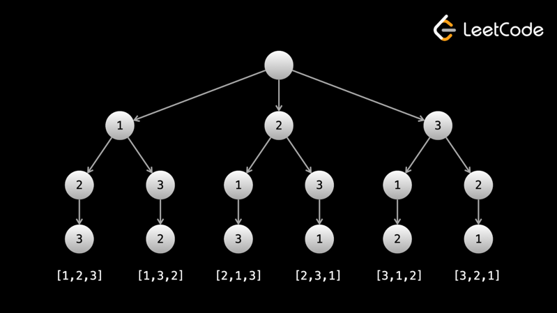

One common type of problem that can be solved with backtracking are problems that ask you to generate all of something.

<h2>Example 1: 46. Permutations</h2>

Given an array nums of distinct integers, return all the possible permutations in any order.

For example, given nums = [1, 2, 3], return [[1,2,3],[1,3,2],[2,1,3],[2,3,1],[3,1,2],[3,2,1]].

A permutation contains all the elements of nums with no duplicates. 
Let's build each permutation using a recursive function backtrack(curr), where curr is the current permutation being built. 
The base case would be when curr.length == nums.length - we have completed a permutation and can't go further. 
On the base case, add curr to the answer and return.

To build all permutations, we need all elements at the first index, and for each of those elements, 
we need all other elements at the second index, and so on. Therefore, 
we should loop over the entire input on each call to backtrack. Because a permutation cannot have duplicates, 
we should check if a number is already in curr before adding it to curr. Each call to backtrack is like a visit 
to a node in the tree of possibilities.

Using nums = [1, 2, 3], the answer "tree" looks like:

The leaves are the base cases/answers to the problem.

First, to generate all permutations, we need to put every number in the first position. For each number in the first position, 
we need to try all other numbers in the second position, and so on.

We will model the backtracking with a tree. Every node in the tree represents a function call. For a given function call, 
the argument curr represents the current permutation we are buiding.

When we add an element to curr, we make another call to backtrack. This is equivalent to moving to a child. 
The root node represents an empty array, and the path from the root to any given node represents curr.

To generate/traverse this tree, we start by calling backtrack with curr = []. Then, we put the first number in the first position 
and call backtrack again. In the second call, we can't put the first number in the second position 
because we already used the first number, so we put the second number instead and call backtrack again.

Eventually, curr will have the same length as nums which indicates that we have used all numbers 
(since duplicates aren't allowed) and we have a valid permutation. This is a leaf node/base case - we add curr to the answer, 
and then return.

Every time we return, exactly like in DFS, we are moving back up the tree. 
Remember: the path from the root to a given node represents curr. When we return, we are removing the last node in the path. 
This means we also need to remove the last element from curr.

After we have tried all possibilities with the first number being in the first position, 
we try the second number in the first position and go through a subtree again. In general, in each call to backtrack, 
we iterate over the input and if we find a number is not in curr, we add it to curr and go through the subtree.

```python
class Solution:
    def permute(self, nums: List[int]) -> List[List[int]]:
        def backtrack(curr):
            if len(curr) == len(nums):
                ans.append(curr[:])
                return
        
            for num in nums:
                if num not in curr:
                    curr.append(num)
                    backtrack(curr)
                    curr.pop()
            
        ans = []
        backtrack([])
        return ans

```

When adding to the answer, we need to create a copy of curr because curr is only a reference to the array's address.

The time complexity of this algorithm is very slow, but the input says that 1 <= nums.length <= 6, so it is expected. 
Let n = nums.length. The initial call to backtrack (the "root" of the tree), makes n calls. 
Each of those calls makes n - 1 calls (avoiding duplicates), and each of those make n - 2, and so on. 
The exact time complexity of the algorithm is actually quite complicated, 
but we can use the logic just stated to estimate it to be around O(n⋅n!). 
There is an extra factor of n because we need to copy each permutation. 
The space complexity is O(n) for curr and the recursion call stack.

<h2>Example 2: 78. Subsets</h2>

Given an integer array nums of unique elements, return all subsets in any order without duplicates.

For example, given nums = [1, 2, 3], return [[],[1],[2],[1,2],[3],[1,3],[2,3],[1,2,3]]

This example is similar to the previous one. There are two main differences: - Length: a subset can have any length, 
whereas a permutation has a fixed length n. - Order of elements: [1, 2, 3] and [3, 2, 1] are different permutations, 
but they are the same subset.

Notice that in the example solution, every answer is sorted - for every number nums[i], 
only numbers after index i show up after it. To avoid duplicates while still finding every subset, 
we can pass an integer i into our backtrack function that represents where we should start iterating. 
When we loop over the input, we loop over [i, n) instead of [0, n). On calls to backtrack, 
we can pass in the index of the number we are adding plus one to make sure we only include numbers after the one we are adding 
for the rest of the subtree.

This is a very common method of avoiding duplicates in backtracking problems - having an integer argument 
that represents a starting point for iteration at each function call.

We can use the same process as in the previous approach to generate the backtracking tree.

The first important thing to understand is what the argument i represents. In the previous problem, 
we iterated over the entire input at each node. We cannot do that here, as it would produce duplicate subsets. 
For example, if we have nums = [1, 2, 3], then we would at one point have curr = [1, 2]. 
When we finish the subtree with 1 at the first position, we would try 2 at the first position next. 
If we considered all numbers at each node, we would end up with curr = [2, 1], 
which is a duplicate of [1, 2] since the order doesn't matter here.

As such, when we add an element to curr, we only want to consider elements that come after that element for the entire subtree. 
We use an argument i that tells us where to start iterating from at each node. If we add an element at index j, 
we pass j + 1 to the next call.

Now that we understand what i does, let's talk about the differences in implementation between this problem and the previous one. 
In the previous problem, the answer nodes were the leaf nodes (as the leaf nodes represented curr having a length of n). 
In this problem, a subset can have any length, so every node is an answer (even the root, as the root represents the empty subset []). 
Therefore, the first thing we will do at each node is add curr to the answer.

The only other difference is that we will iterate over the input starting from i instead of iterating over the entire input. 
As mentioned above, this will ensure that we don't have duplicates in our answer.

```python
class Solution:
    def subsets(self, nums: List[int]) -> List[List[int]]:
        def backtrack(curr, i):
            if i > len(nums):
                return

            ans.append(curr[:])
            for j in range(i, len(nums)):
                curr.append(nums[j])
                backtrack(curr, j + 1)
                curr.pop()

        ans = []
        backtrack([], 0)
        return ans

```

This time our base case is when i > nums.length - we have run out of numbers to use. 
The modification of curr and the undoing of the modification remain the same.

You may notice that the base case is never actually hit because the function can't be called with an argument greater 
than the length of the input. We have included the condition for clarity.

There are subsets, where n is the length of the input array - for each element, we can either take it or not take it. 
For the time complexity, you can think of the algorithm as a DFS on a tree with nodes. At each node, 
we make a copy of curr, so the time complexity is O(n⋅2n). 
The space complexity is O(n) for curr and the recursion call stack.
